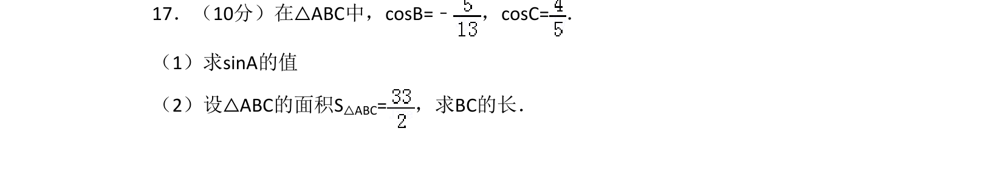
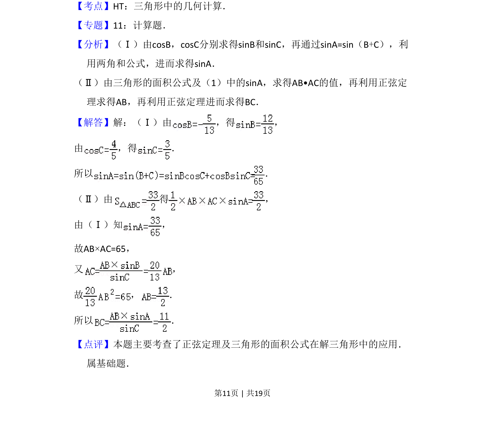

## 题面

## 摘要

在三角形中已知两角余弦求第三角正弦，并用面积公式和正弦定理计算边长。

## 关联考点

- [[126-定理|正弦定理]]
- [[619-三角形面积公式|三角形面积公式]]
- [[634-两角和的正弦公式|两角和正弦公式]]

## 答案与解析

> 📄 原 PDF 第 11 页：`素材/真题/吉林/2008-2024·（吉林）数学高考真题/2008年高考数学试卷（理）（全国卷Ⅱ）（解析卷）.pdf`

<!-- 题干文本-start -->
## 题干文本
17．（10分）在△ABC中，cosB=﹣ ，cosC=．
（1）求sinA的值
（2）设△ABC的面积S△ABC=，求BC的长．
<!-- 题干文本-end -->

<!-- 解析文本-start -->
## 解析文本
【考点】HT：三角形中的几何计算．菁优网版权所有
【专题】11：计算题．
【分析】（Ⅰ）由cosB，cosC分别求得sinB和sinC，再通过sinA=sin（B+C），利
用两角和公式，进而求得sinA．
（Ⅱ）由三角形的面积公式及（1）中的sinA，求得AB•AC的值，再利用正弦定
理求得AB，再利用正弦定理进而求得BC．
【解答】解：（Ⅰ）由 ，得 ，
由 ，得 ．
所以 ．
（Ⅱ）由 得 ，
由（Ⅰ）知 ，
故AB×AC=65，
又 ，
故 ， ．
所以 ．
【点评】本题主要考查了正弦定理及三角形的面积公式在解三角形中的应用．
属基础题．
<!-- 解析文本-end -->
