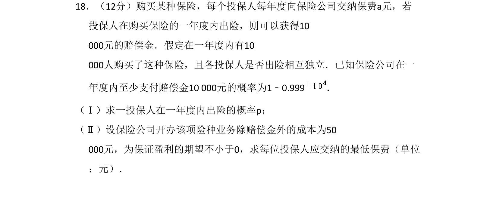
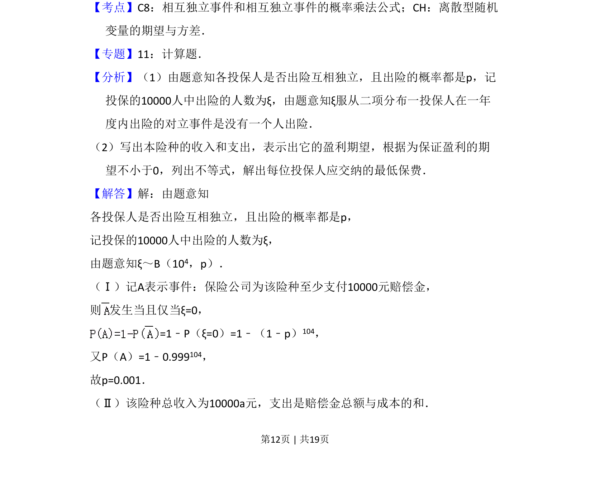
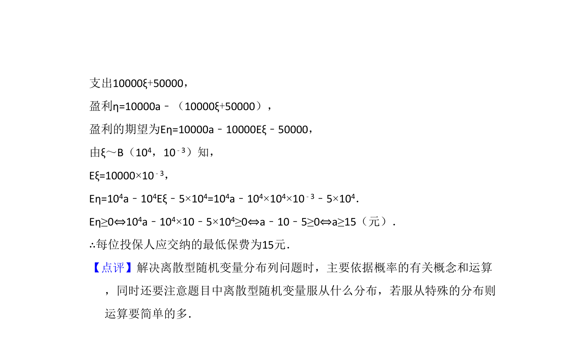

## 题面

## 摘要

该题考查二项分布下投保人出险概率的求解及基于盈利期望确定最低保费。

## 关联考点

- [[468-事件相互独立性-高中|相互独立事件]]
- [[469-二项分布|二项分布]]
- [[1039-离散型随机变量的期望|离散型随机变量的期望]]

## 答案与解析

> 📄 原 PDF 第 12 页：`素材/真题/吉林/2008-2024·（吉林）数学高考真题/2008年高考数学试卷（理）（全国卷Ⅱ）（解析卷）.pdf`
