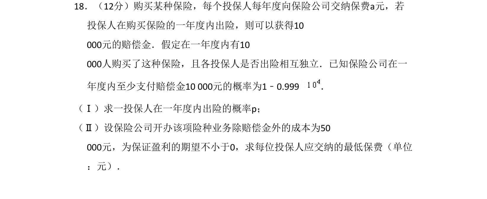
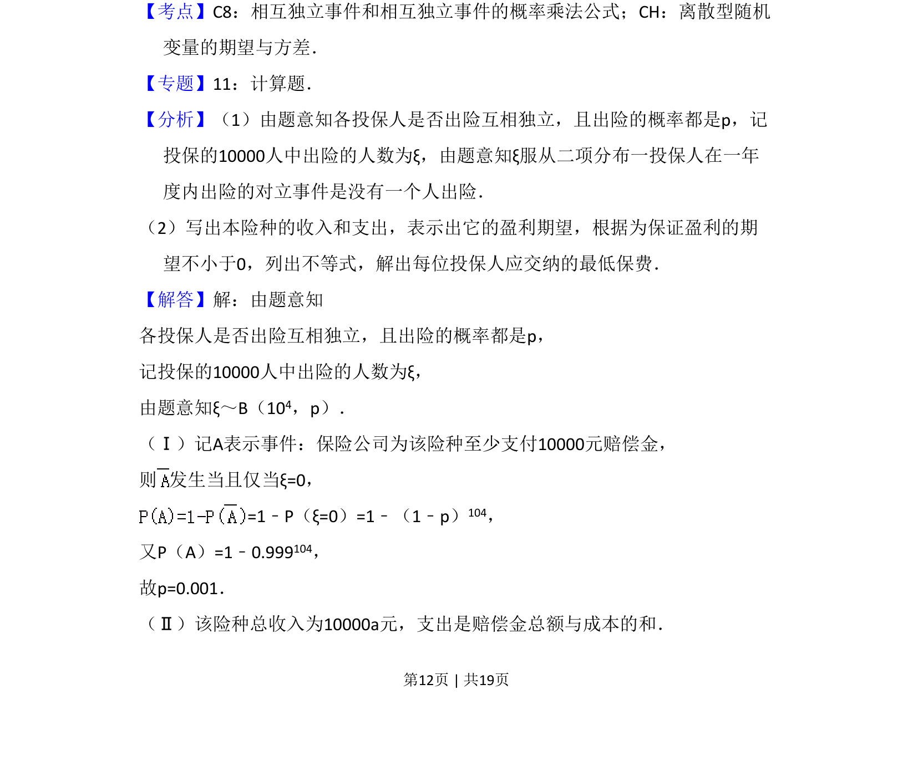
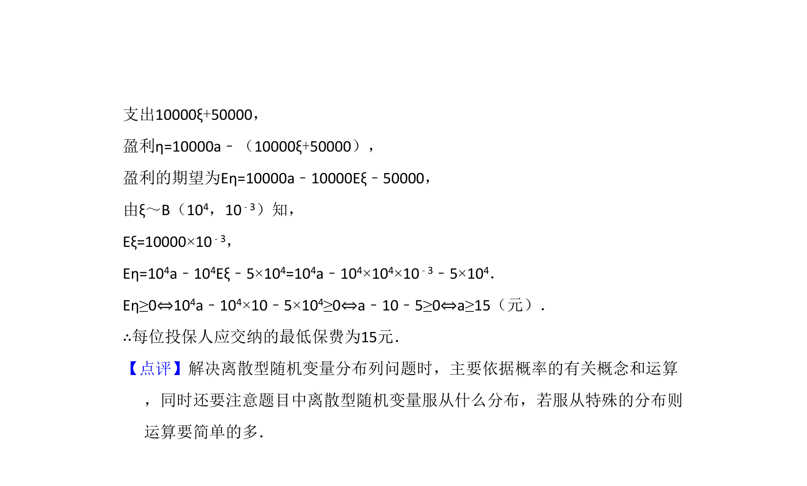

## 题面

## 摘要

该题考查二项分布下投保人出险概率的求解及基于盈利期望确定最低保费。

## 关联考点

- [[468-事件相互独立性-高中|相互独立事件]]
- [[469-二项分布|二项分布]]
- [[501-离散型随机变量期望|离散型随机变量的期望]]

## 答案与解析

> 📄 原 PDF 第 12 页：`素材/真题/吉林/2008-2024·（吉林）数学高考真题/2008年高考数学试卷（理）（全国卷Ⅱ）（解析卷）.pdf`

<!-- 题干文本-start -->
## 题干文本
18．（12分）购买某种保险，每个投保人每年度向保险公司交纳保费a元，若
投保人在购买保险的一年度内出险，则可以获得10 
000元的赔偿金．假定在一年度内有10 
000人购买了这种保险，且各投保人是否出险相互独立．已知保险公司在一
年度内至少支付赔偿金10 000元的概率为1﹣0.999．
（Ⅰ）求一投保人在一年度内出险的概率p；
（Ⅱ）设保险公司开办该项险种业务除赔偿金外的成本为50 
000元，为保证盈利的期望不小于0，求每位投保人应交纳的最低保费（单位
：元）．
<!-- 题干文本-end -->

<!-- 解析文本-start -->
## 解析文本
【考点】C8：相互独立事件和相互独立事件的概率乘法公式；CH：离散型随机
变量的期望与方差．菁优网版权所有
【专题】11：计算题．
【分析】（1）由题意知各投保人是否出险互相独立，且出险的概率都是p，记
投保的10000人中出险的人数为ξ，由题意知ξ服从二项分布一投保人在一年
度内出险的对立事件是没有一个人出险．
（2）写出本险种的收入和支出，表示出它的盈利期望，根据为保证盈利的期
望不小于0，列出不等式，解出每位投保人应交纳的最低保费．
【解答】解：由题意知
各投保人是否出险互相独立，且出险的概率都是p，
记投保的10000人中出险的人数为ξ，
由题意知ξ～B（104，p）．
（Ⅰ）记A表示事件：保险公司为该险种至少支付10000元赔偿金，
则 发生当且仅当ξ=0，
=1﹣P（ξ=0）=1﹣（1﹣p）104，
又P（A）=1﹣0.999104，
故p=0.001．
（Ⅱ）该险种总收入为10000a元，支出是赔偿金总额与成本的和．
<!-- 解析文本-end -->
