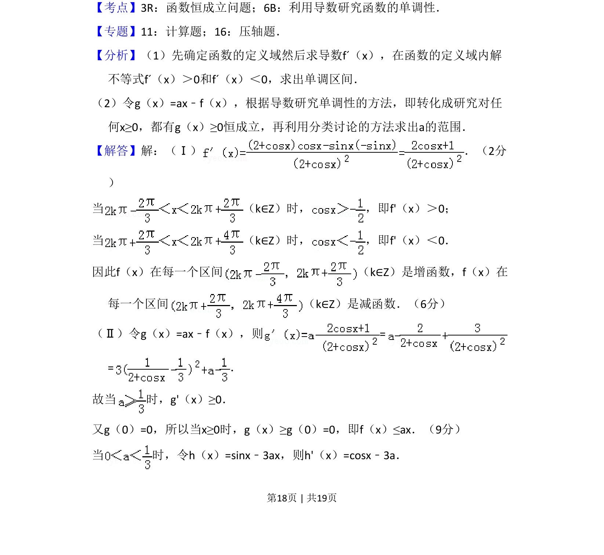
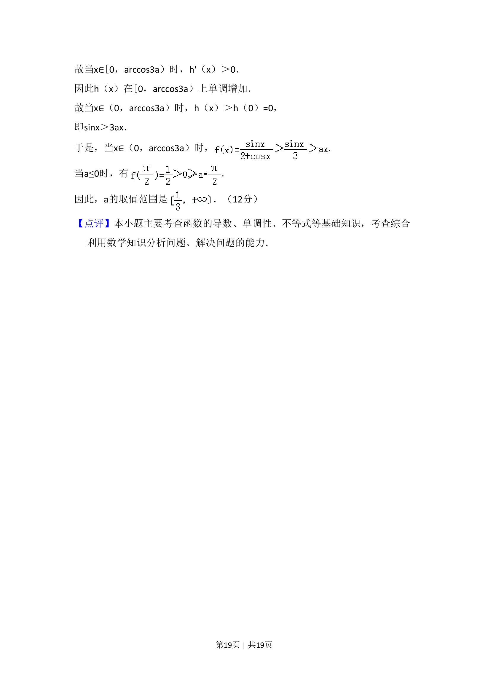

## 题面

## 摘要

已知函数求单调区间以及不等式恒成立求参数范围

## 关联考点

- [[708-利用导数研究单调性|利用导数研究单调性]]
- [[536-函数恒成立问题|函数恒成立问题]]

## 答案与解析

> 📄 原 PDF 第 18 页：`素材/真题/吉林/2008-2024·（吉林）数学高考真题/2008年高考数学试卷（理）（全国卷Ⅱ）（解析卷）.pdf`

<!-- 题干文本-start -->
## 题干文本
22．（12分）设函数 ．
（Ⅰ）求f（x）的单调区间；
（Ⅱ）如果对任何x≥0，都有f（x）≤ax，求a的取值范围．
<!-- 题干文本-end -->

<!-- 解析文本-start -->
## 解析文本
【考点】3R：函数恒成立问题；6B：利用导数研究函数的单调性．菁优网版权所有
【专题】11：计算题；16：压轴题．
【分析】（1）先确定函数的定义域然后求导数fˊ（x），在函数的定义域内解
不等式fˊ（x）＞0和fˊ（x）＜0，求出单调区间．
（2）令g（x）=ax﹣f（x），根据导数研究单调性的方法，即转化成研究对任
何x≥0，都有g（x）≥0恒成立，再利用分类讨论的方法求出a的范围．
【解答】解：（Ⅰ） ．（2分
）
当 （k∈Z）时， ，即f'（x）＞0；
当 （k∈Z）时， ，即f'（x）＜0．
因此f（x）在每一个区间 （k∈Z）是增函数，f（x）在
每一个区间 （k∈Z）是减函数．（6分）
（Ⅱ）令g（x）=ax﹣f（x），则=
=．
故当 时，g'（x）≥0．
又g（0）=0，所以当x≥0时，g（x）≥g（0）=0，即f（x）≤ax．（9分）
当 时，令h（x）=sinx﹣3ax，则h'（x）=cosx﹣3a．
<!-- 解析文本-end -->
