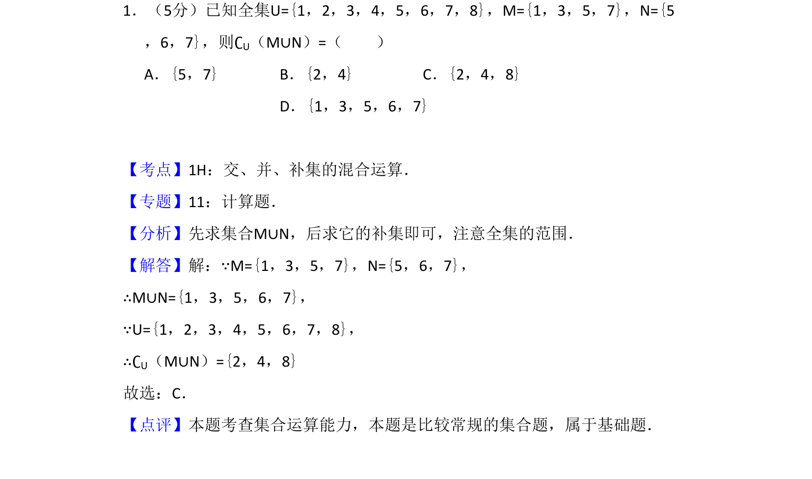
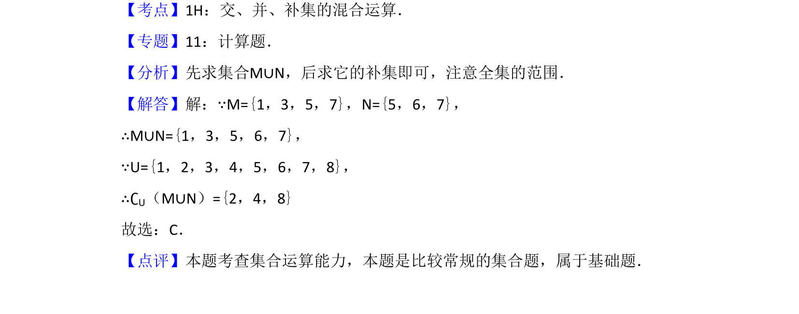

## 题面

## 摘要

已知全集和两个集合，求并集的补集。

## 关联考点

- [[314-集合的运算|集合运算]]
- [[1101-补集|补集]]
- [[550-并集|并集]]

## 答案与解析

> 📄 原 PDF 第 1 页：`素材/真题/吉林/2008-2024·（吉林）数学高考真题/2009年高考数学试卷（文）（全国卷Ⅱ）（解析卷）.pdf`

<!-- 题干文本-start -->
## 题干文本
1．（5分）已知全集U={1，2，3，4，5，6，7，8}，M={1，3，5，7}，N={5
，6，7}，则∁U（M∪N）=（　　）
A．{5，7}B．{2，4}C．{2，4，8}
D．{1，3，5，6，7}
<!-- 题干文本-end -->

<!-- 解析文本-start -->
## 解析文本
【考点】1H：交、并、补集的混合运算．菁优网版权所有
【专题】11：计算题．
【分析】先求集合M∪N，后求它的补集即可，注意全集的范围．
【解答】解：∵M={1，3，5，7}，N={5，6，7}，
∴M∪N={1，3，5，6，7}，
∵U={1，2，3，4，5，6，7，8}，
∴∁U（M∪N）={2，4，8}
故选：C．
【点评】本题考查集合运算能力，本题是比较常规的集合题，属于基础题．
<!-- 解析文本-end -->
