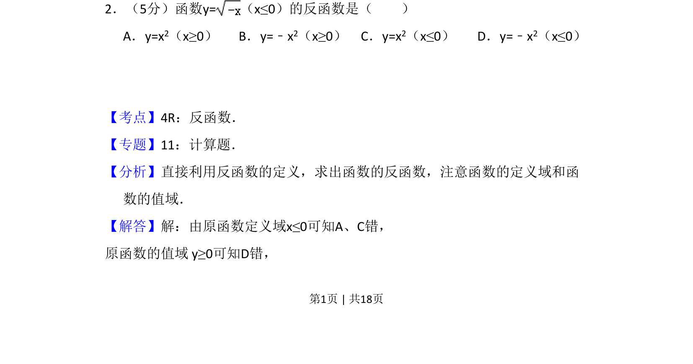
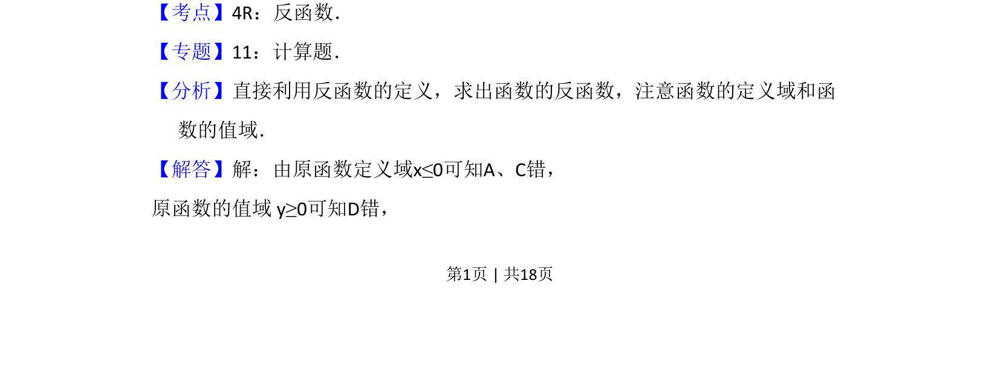
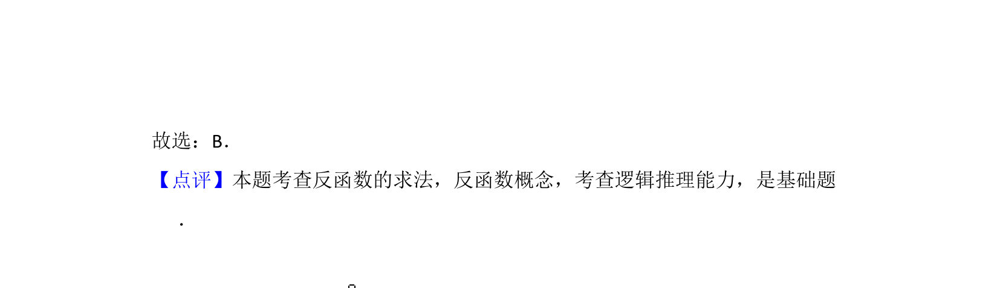

## 题面

## 摘要

函数反函数求解，结合定义域与值域排除选项

## 关联考点

- [[292-反函数|反函数]]
- [[821-定义域|定义域]]
- [[657-值域|值域]]

## 答案与解析

> 📄 原 PDF 第 1 页：`素材/真题/吉林/2008-2024·（吉林）数学高考真题/2009年高考数学试卷（文）（全国卷Ⅱ）（解析卷）.pdf`

<!-- 题干文本-start -->
## 题干文本
2．（5分）函数y=（x≤0）的反函数是（　　）
A．y=x2（x≥0）B．y=﹣x 2（x≥0）C．y=x 2（x≤0）D．y=﹣x 2（x≤0）
<!-- 题干文本-end -->

<!-- 解析文本-start -->
## 解析文本
【考点】4R：反函数．菁优网版权所有
【专题】11：计算题．
【分析】直接利用反函数的定义，求出函数的反函数，注意函数的定义域和函
数的值域．
【解答】解：由原函数定义域x≤0可知A、C错，
原函数的值域 y≥0可知D错，
<!-- 解析文本-end -->
