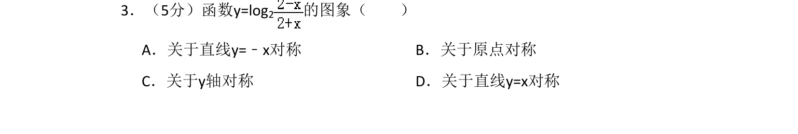
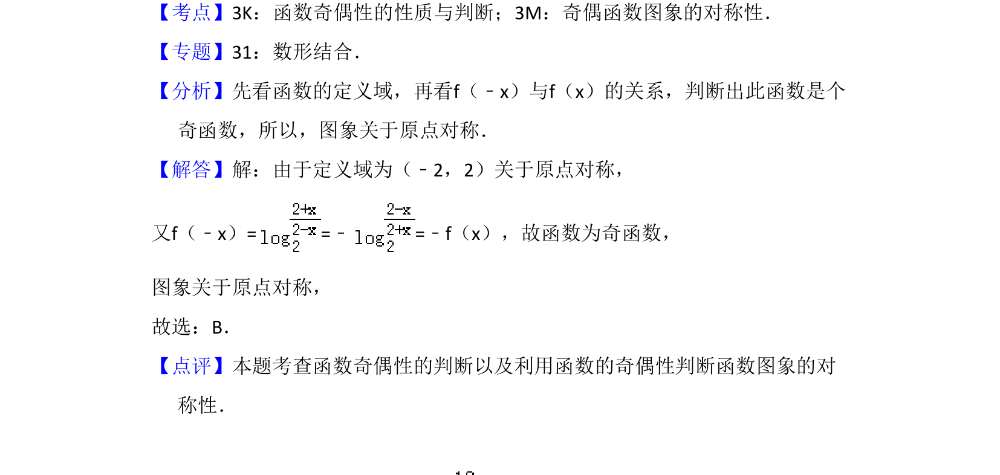

## 题面

## 摘要

判断函数奇偶性，利用奇函数图象对称性得出关于原点对称。

## 关联考点

- [[284-函数的奇偶性|函数奇偶性]]
- [[771-图象对称性|图象对称性]]

## 答案与解析

> 📄 原 PDF 第 2 页：`素材/真题/吉林/2008-2024·（吉林）数学高考真题/2009年高考数学试卷（文）（全国卷Ⅱ）（解析卷）.pdf`

<!-- 题干文本-start -->
## 题干文本
3．（5分）函数y=log2 的图象（　　）
A．关于直线y=﹣x对称B．关于原点对称
C．关于y轴对称D．关于直线y=x对称
<!-- 题干文本-end -->

<!-- 解析文本-start -->
## 解析文本
【考点】3K：函数奇偶性的性质与判断；3M：奇偶函数图象的对称性．菁优网版权所有
【专题】31：数形结合．
【分析】先看函数的定义域，再看f（﹣x）与f（x）的关系，判断出此函数是个
奇函数，所以，图象关于原点对称．
【解答】解：由于定义域为（﹣2，2）关于原点对称，
又f（﹣x）= =﹣=﹣f（x），故函数为奇函数，
图象关于原点对称，
故选：B．
【点评】本题考查函数奇偶性的判断以及利用函数的奇偶性判断函数图象的对
称性．
<!-- 解析文本-end -->
