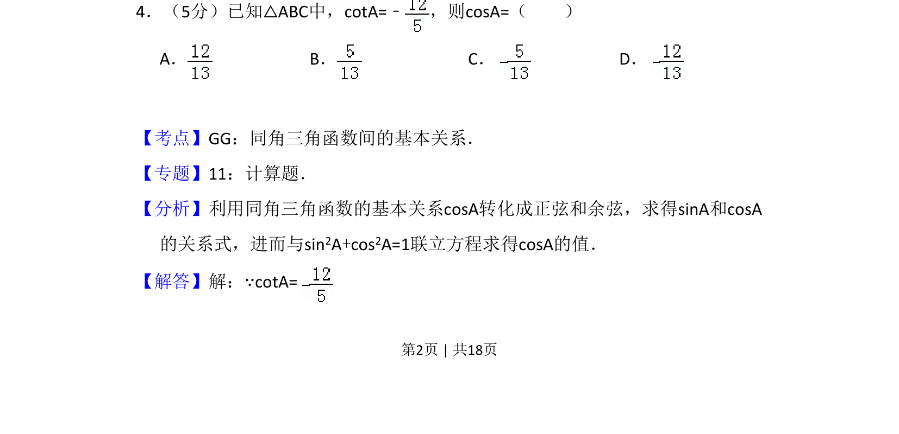
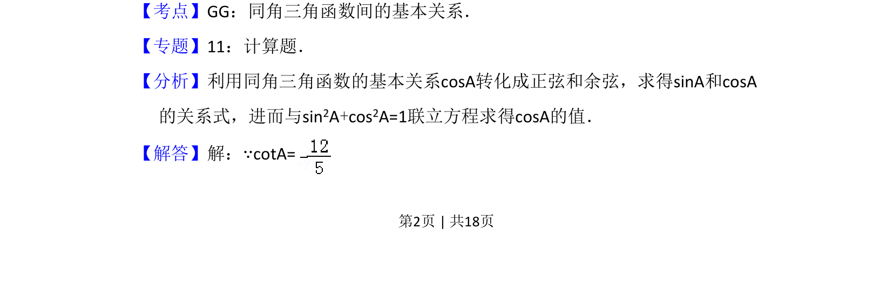
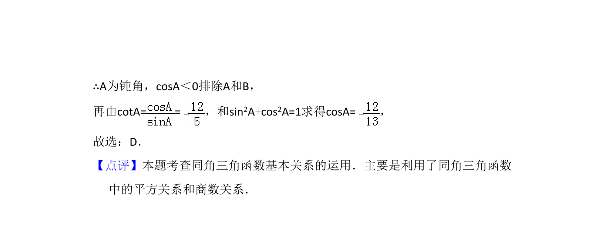

## 题面

## 摘要

利用同角三角函数基本关系，由余切值求解余弦值，涉及符号判断与方程联立。

## 关联考点

- [[同角三角函数基本关系]]
- [[250-正弦|正弦]]
- [[239-余弦|余弦]]
- [[余切]]

## 答案与解析

> 📄 原 PDF 第 2 页：`素材/真题/吉林/2008-2024·（吉林）数学高考真题/2009年高考数学试卷（文）（全国卷Ⅱ）（解析卷）.pdf`
