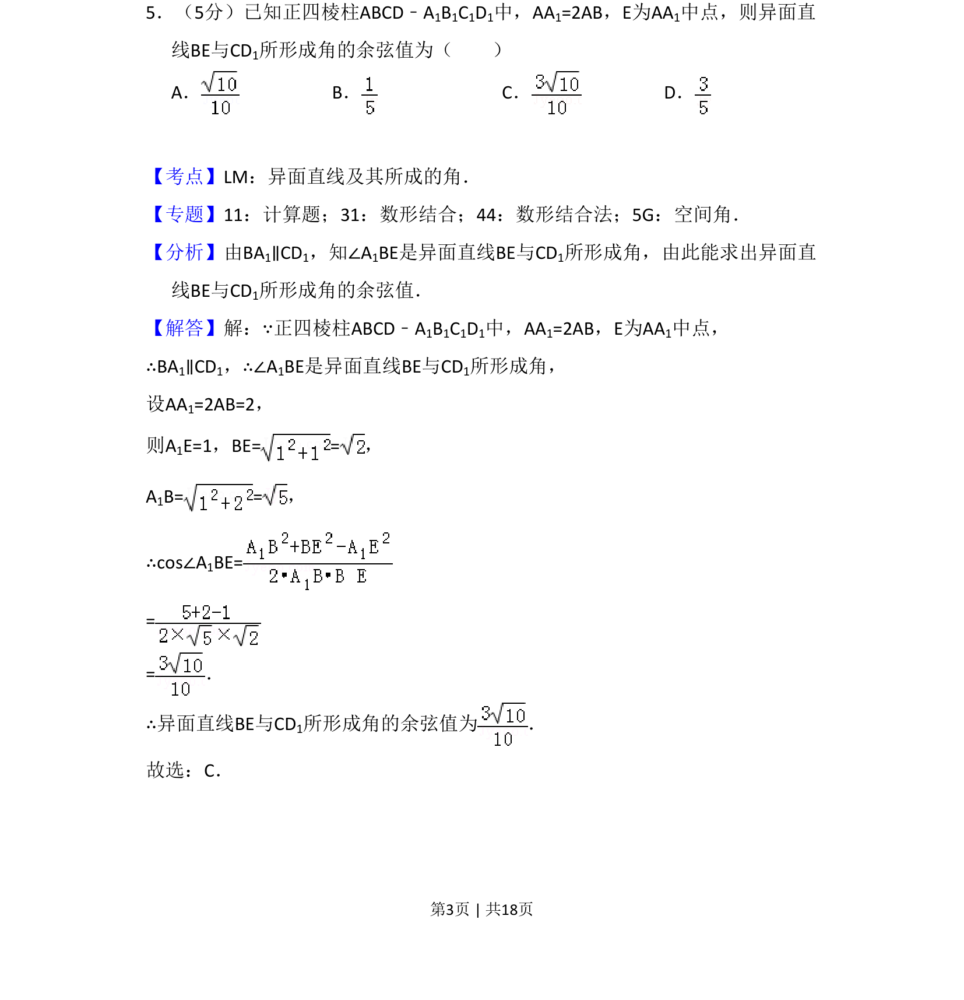
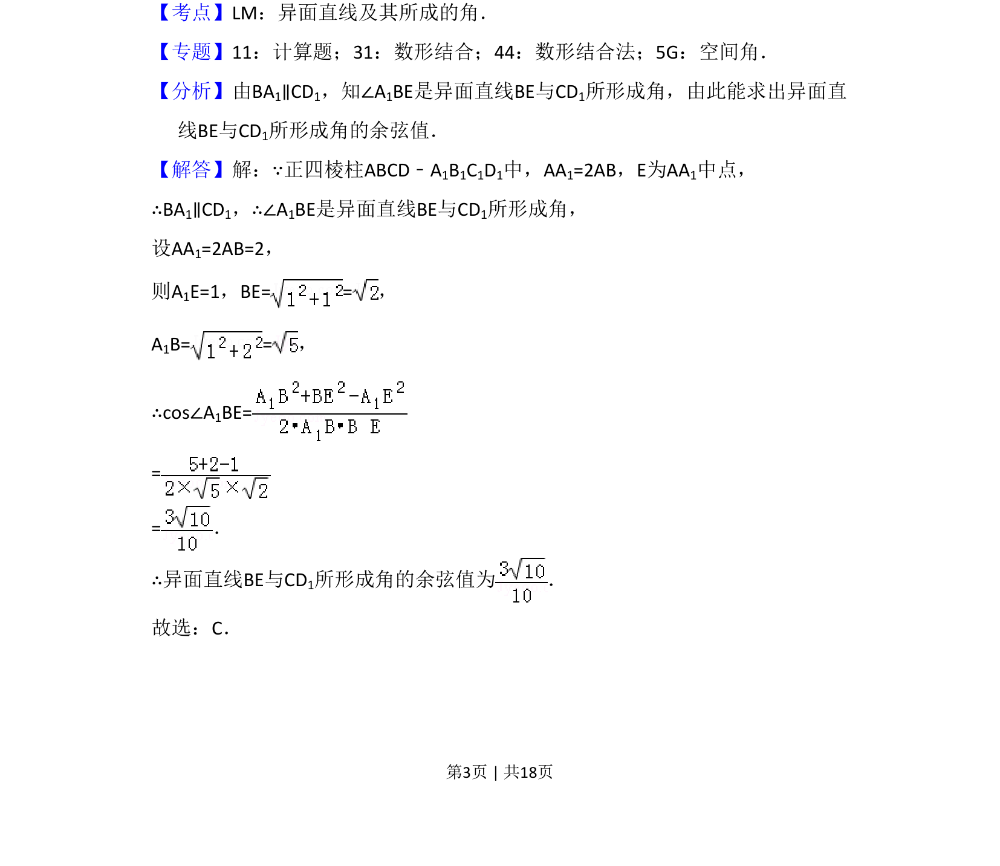
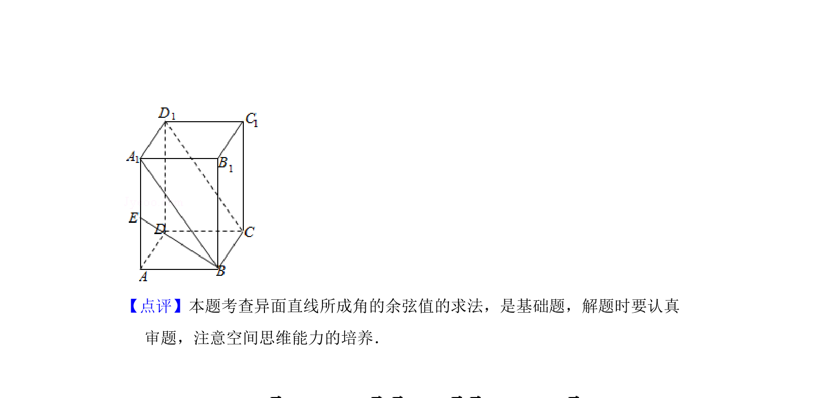

## 题面

## 摘要

求正四棱柱中异面直线BE与CD1所成角的余弦值，通过平移直线构造三角形计算

## 关联考点

- [[异面直线及其所成的角]]
- [[189-勾股定理|勾股定理]]
- [[126-定理|余弦定理]]
- [[数形结合]]

## 答案与解析

> 📄 原 PDF 第 3 页：`素材/真题/吉林/2008-2024·（吉林）数学高考真题/2009年高考数学试卷（文）（全国卷Ⅱ）（解析卷）.pdf`
