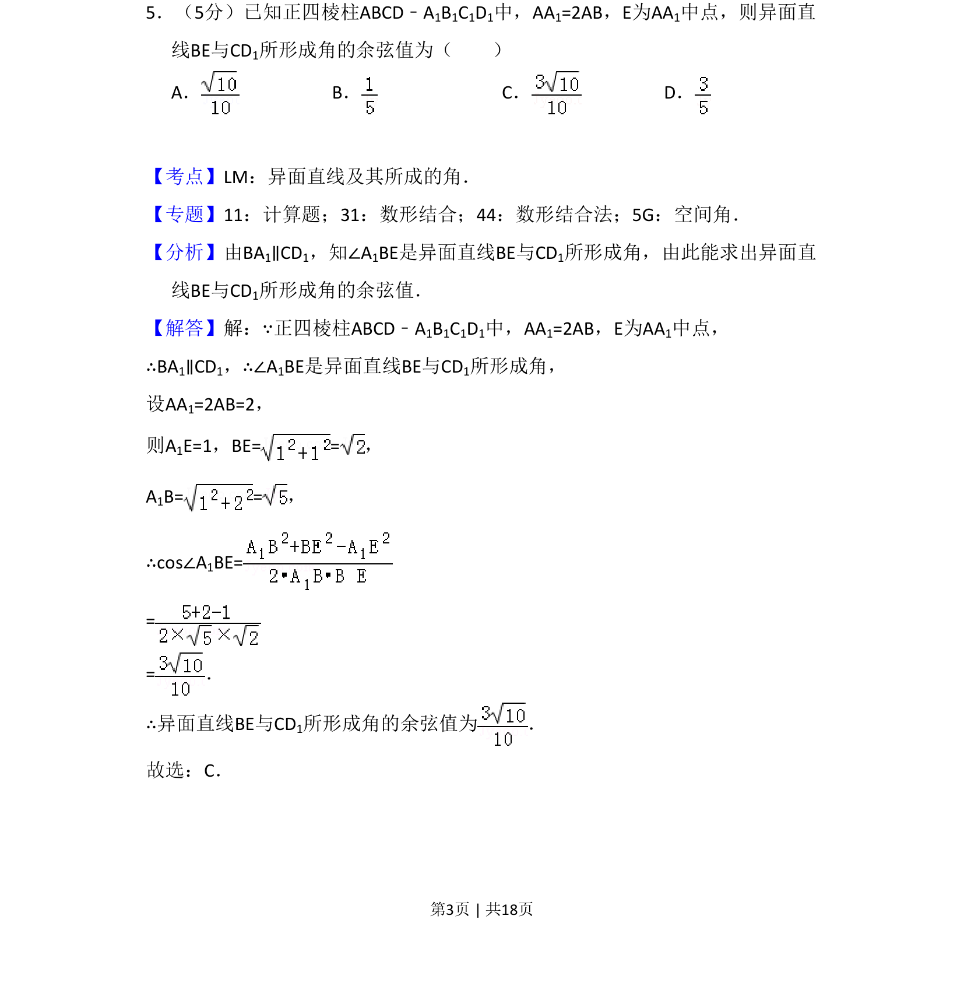
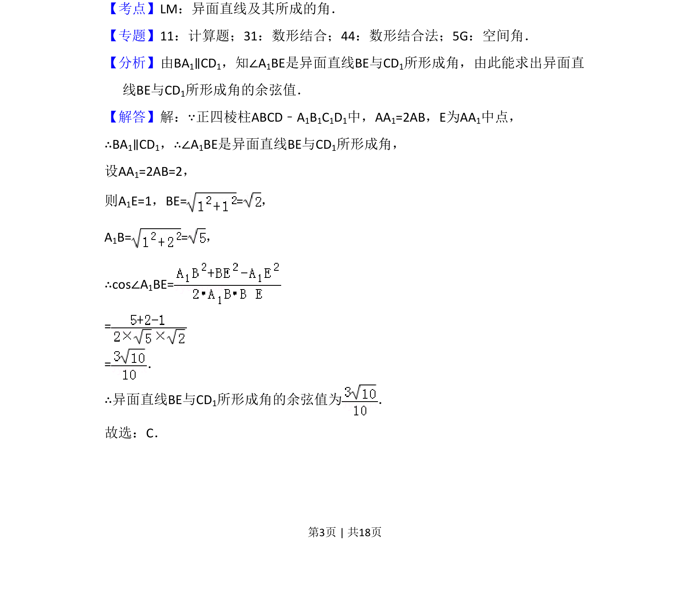
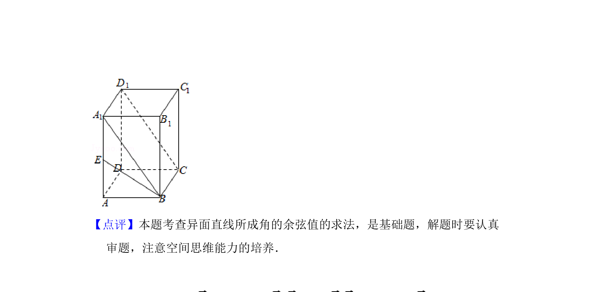

## 题面

## 摘要

求正四棱柱中异面直线BE与CD1所成角的余弦值，通过平移直线构造三角形计算

## 关联考点

- [[862-异面直线及其所成的角|异面直线及其所成的角]]
- [[189-勾股定理|勾股定理]]
- [[126-定理|余弦定理]]
- [[897-数形结合|数形结合]]

## 答案与解析

> 📄 原 PDF 第 3 页：`素材/真题/吉林/2008-2024·（吉林）数学高考真题/2009年高考数学试卷（文）（全国卷Ⅱ）（解析卷）.pdf`

<!-- 题干文本-start -->
## 题干文本
5．（5分）已知正四棱柱ABCD﹣A1B1C1D1中，AA1=2AB，E为AA1中点，则异面直
线BE与CD1所形成角的余弦值为（　　）
A．B．C．D．
<!-- 题干文本-end -->

<!-- 解析文本-start -->
## 解析文本
【考点】LM：异面直线及其所成的角．菁优网版权所有
【专题】11：计算题；31：数形结合；44：数形结合法；5G：空间角．
【分析】由BA1∥CD1，知∠A1BE是异面直线BE与CD1所形成角，由此能求出异面直
线BE与CD1所形成角的余弦值．
【解答】解：∵正四棱柱ABCD﹣A1B1C1D1中，AA1=2AB，E为AA1中点，
∴BA1∥CD1，∴∠A1BE是异面直线BE与CD1所形成角，
设AA1=2AB=2，
则A1E=1，BE= =，
A1B= =，
∴cos∠A1BE=
=
=．
∴异面直线BE与CD1所形成角的余弦值为 ．
故选：C．
<!-- 解析文本-end -->
