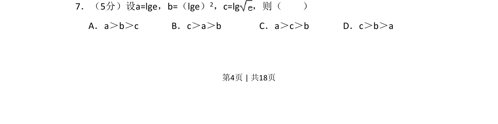
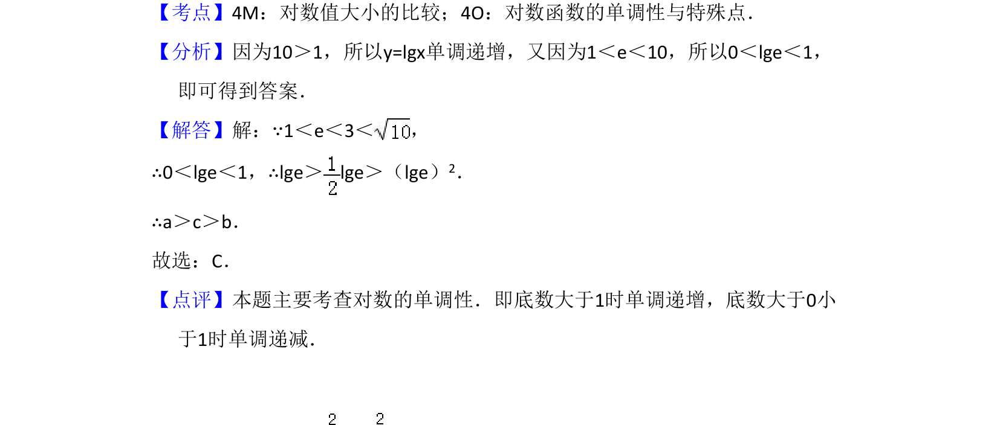

## 题面

## 摘要

比较对数式大小，涉及对数运算与估算。

## 关联考点

- [[832-对数运算|对数运算]]
- [[889-数值比较|比较大小]]
- [[432-导数与函数单调性|函数单调性]]

## 答案与解析

> 📄 原 PDF 第 4 页：`素材/真题/吉林/2008-2024·（吉林）数学高考真题/2009年高考数学试卷（文）（全国卷Ⅱ）（解析卷）.pdf`
