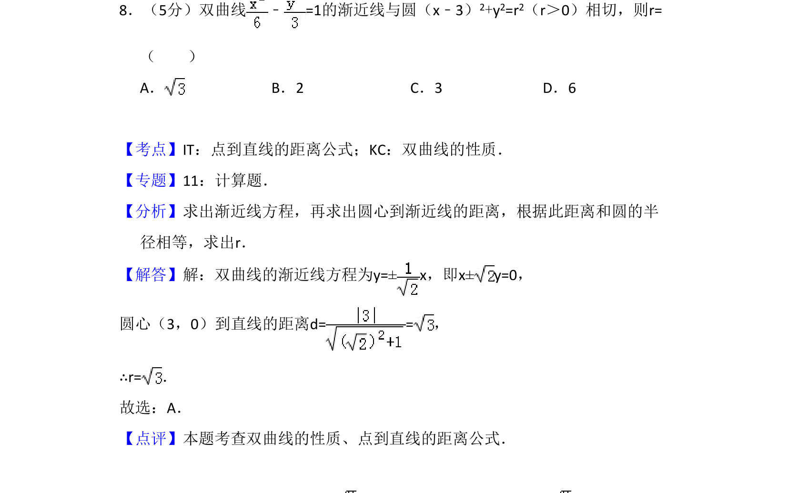
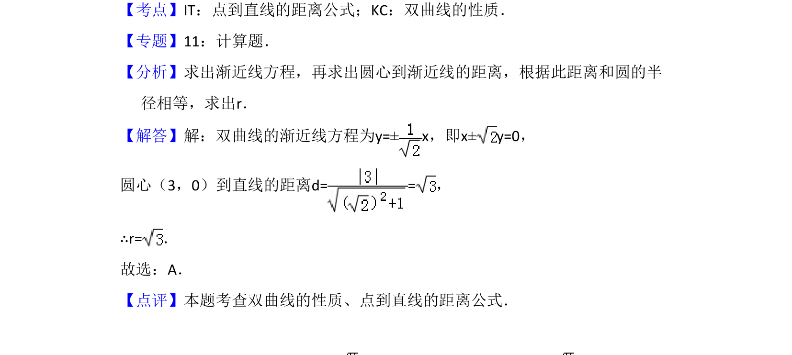

## 题面

## 摘要

此题考查双曲线的渐近线方程及与圆相切时半径的求解，利用点到直线距离等于半径。

## 关联考点

- [[731-双曲线的性质|双曲线的性质]]
- [[570-点到直线的距离公式|点到直线的距离公式]]

## 答案与解析

> 📄 原 PDF 第 5 页：`素材/真题/吉林/2008-2024·（吉林）数学高考真题/2009年高考数学试卷（文）（全国卷Ⅱ）（解析卷）.pdf`
