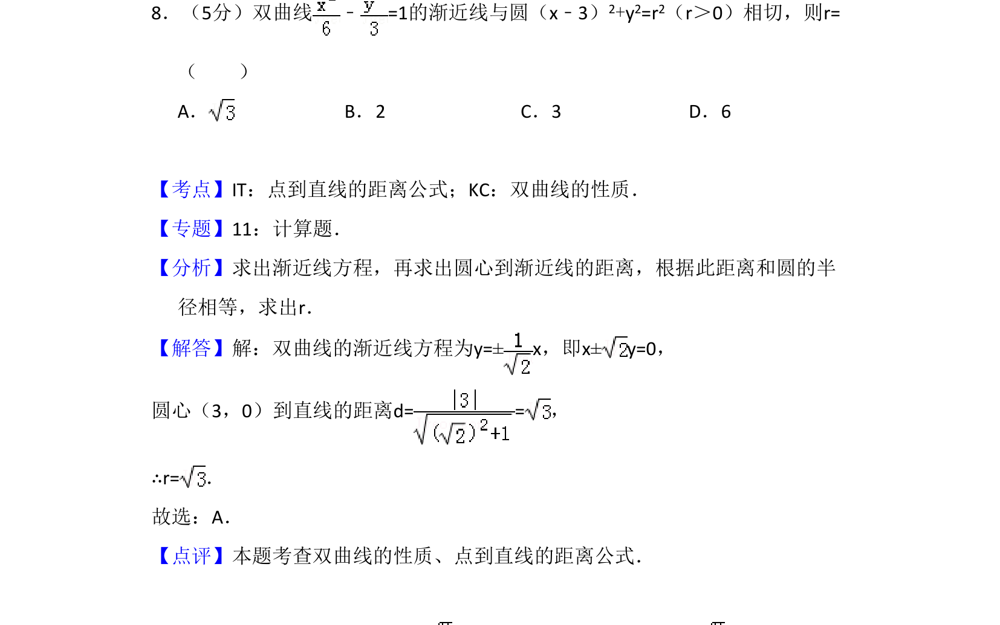
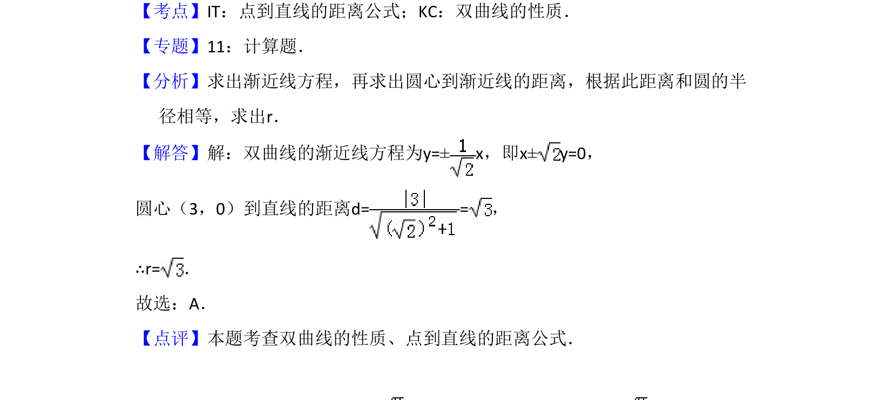

## 题面

## 摘要

此题考查双曲线的渐近线方程及与圆相切时半径的求解，利用点到直线距离等于半径。

## 关联考点

- [[731-双曲线的性质|双曲线的性质]]
- [[570-点到直线的距离公式|点到直线的距离公式]]

## 答案与解析

> 📄 原 PDF 第 5 页：`素材/真题/吉林/2008-2024·（吉林）数学高考真题/2009年高考数学试卷（文）（全国卷Ⅱ）（解析卷）.pdf`

<!-- 题干文本-start -->
## 题干文本
8．（5分）双曲线 ﹣=1的渐近线与圆（x﹣3） 2+y2=r2（r＞0）相切，则r=
（　　）
A．B．2 C．3 D．6
<!-- 题干文本-end -->

<!-- 解析文本-start -->
## 解析文本
【考点】IT：点到直线的距离公式；KC：双曲线的性质．菁优网版权所有
【专题】11：计算题．
【分析】求出渐近线方程，再求出圆心到渐近线的距离，根据此距离和圆的半
径相等，求出r．
【解答】解：双曲线的渐近线方程为y=±x，即x±y=0，
圆心（3，0）到直线的距离d= =，
∴r=．
故选：A．
【点评】本题考查双曲线的性质、点到直线的距离公式．
<!-- 解析文本-end -->
