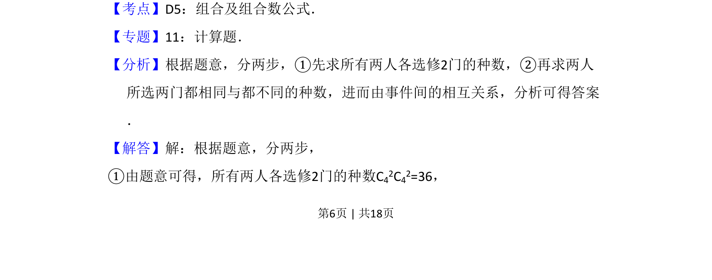
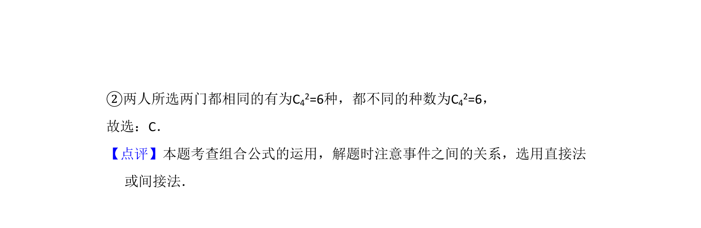

## 题面

## 摘要

甲、乙两人从4门课程中各选修2门，求恰有1门相同课程的选法数。

## 关联考点

- [[505-组合概念|组合]]
- [[504-组合数公式|组合数公式]]
- [[697-分步乘法计数原理|分步乘法计数原理]]

## 答案与解析

> 📄 原 PDF 第 6 页：`素材/真题/吉林/2008-2024·（吉林）数学高考真题/2009年高考数学试卷（文）（全国卷Ⅱ）（解析卷）.pdf`
