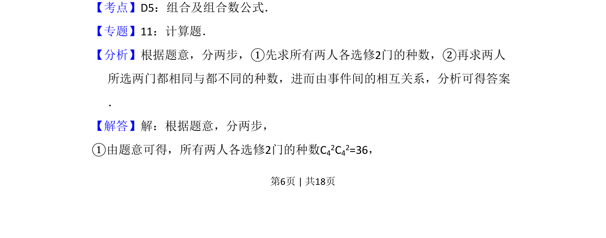
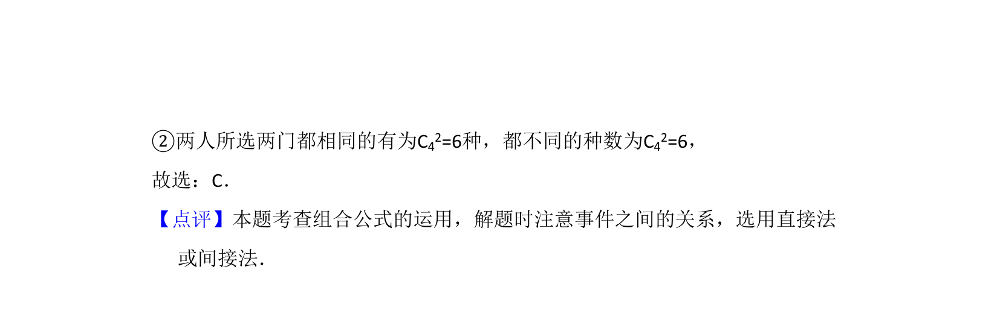

## 题面

## 摘要

甲、乙两人从4门课程中各选修2门，求恰有1门相同课程的选法数。

## 关联考点

- [[505-组合概念|组合]]
- [[504-组合数公式|组合数公式]]
- [[697-分步乘法计数原理|分步乘法计数原理]]

## 答案与解析

> 📄 原 PDF 第 6 页：`素材/真题/吉林/2008-2024·（吉林）数学高考真题/2009年高考数学试卷（文）（全国卷Ⅱ）（解析卷）.pdf`

<!-- 题干文本-start -->
## 题干文本
10．（5分）甲、乙两人从4门课程中各选修2门，则甲、乙所选的课程中恰有1
门相同的选法有（　　）
A．6种B．12种C．24种D．30种
<!-- 题干文本-end -->

<!-- 解析文本-start -->
## 解析文本
【考点】D5：组合及组合数公式．菁优网版权所有
【专题】11：计算题．
【分析】根据题意，分两步，①先求所有两人各选修2门的种数，②再求两人
所选两门都相同与都不同的种数，进而由事件间的相互关系，分析可得答案
．
【解答】解：根据题意，分两步，
①由题意可得，所有两人各选修2门的种数C42C42=36，
<!-- 解析文本-end -->
