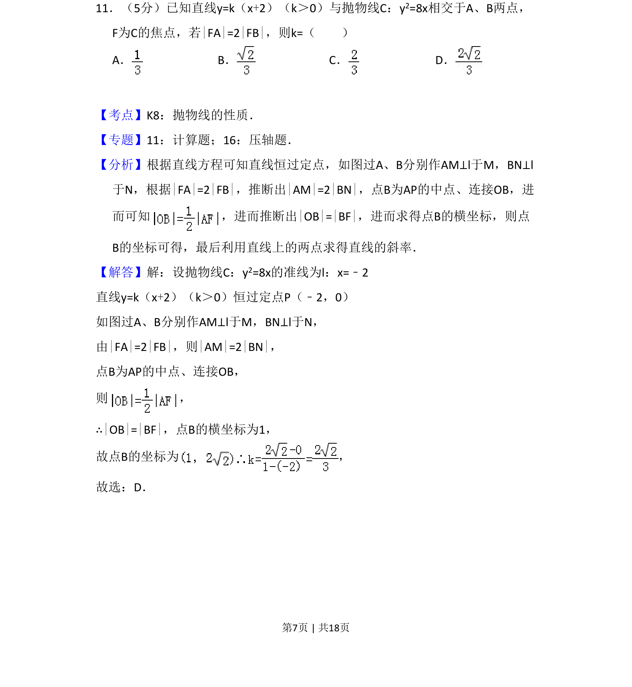
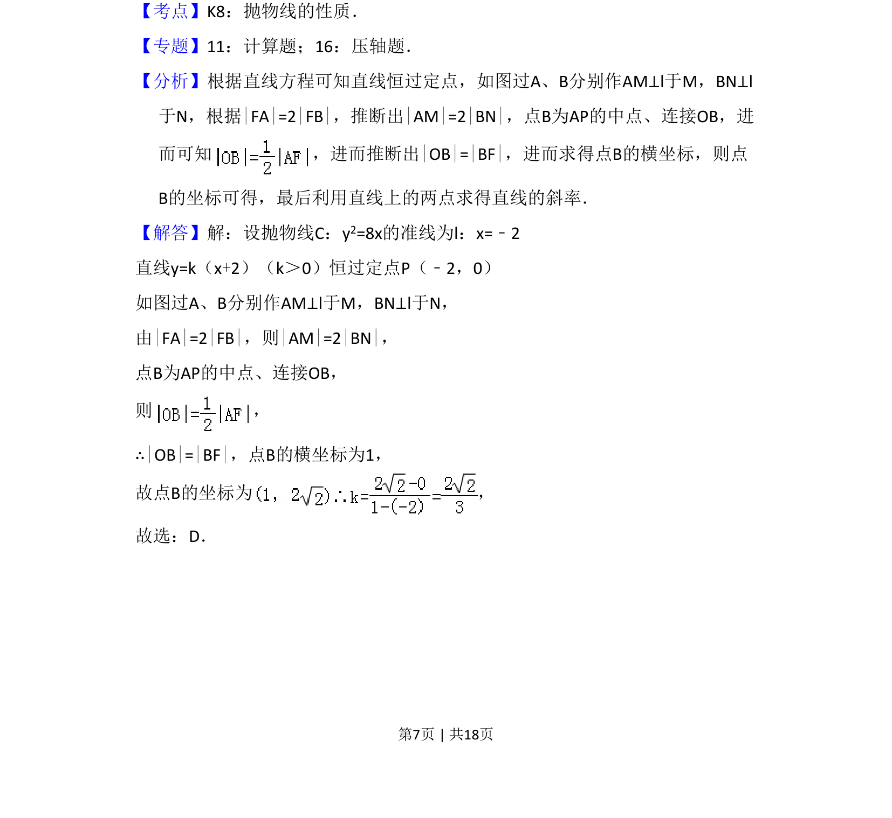
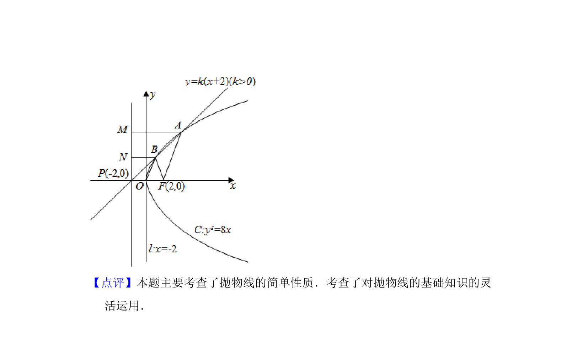

## 题面

## 摘要

直线与抛物线相交，利用抛物线定义和几何关系求直线斜率。

## 关联考点

- [[879-抛物线的性质|抛物线的性质]]
- [[1016-直线与抛物线位置关系|直线与抛物线的位置关系]]
- [[663-几何关系转化|几何关系转化]]

## 答案与解析

> 📄 原 PDF 第 7 页：`素材/真题/吉林/2008-2024·（吉林）数学高考真题/2009年高考数学试卷（文）（全国卷Ⅱ）（解析卷）.pdf`

<!-- 题干文本-start -->
## 题干文本
11．（5分）已知直线y=k（x+2）（k＞0）与抛物线C：y2=8x相交于A、B两点，
F为C的焦点，若|FA|=2|FB|，则k=（　　）
A．B．C．D．
<!-- 题干文本-end -->

<!-- 解析文本-start -->
## 解析文本
【考点】K8：抛物线的性质．菁优网版权所有
【专题】11：计算题；16：压轴题．
【分析】根据直线方程可知直线恒过定点，如图过A、B分别作AM⊥l于M，BN⊥l
于N，根据|FA|=2|FB|，推断出|AM|=2|BN|，点B为AP的中点、连接OB，进
而可知 ，进而推断出|OB|=|BF|，进而求得点B的横坐标，则点
B的坐标可得，最后利用直线上的两点求得直线的斜率．
【解答】解：设抛物线C：y2=8x的准线为l：x=﹣2
直线y=k（x+2）（k＞0）恒过定点P（﹣2，0）
如图过A、B分别作AM⊥l于M，BN⊥l于N，
由|FA|=2|FB|，则|AM|=2|BN|，
点B为AP的中点、连接OB，
则 ，
∴|OB|=|BF|，点B的横坐标为1，
故点B的坐标为 ，
故选：D．
<!-- 解析文本-end -->
