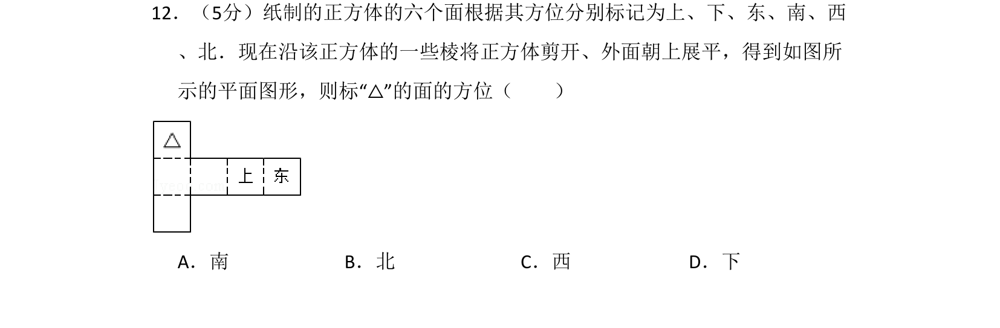
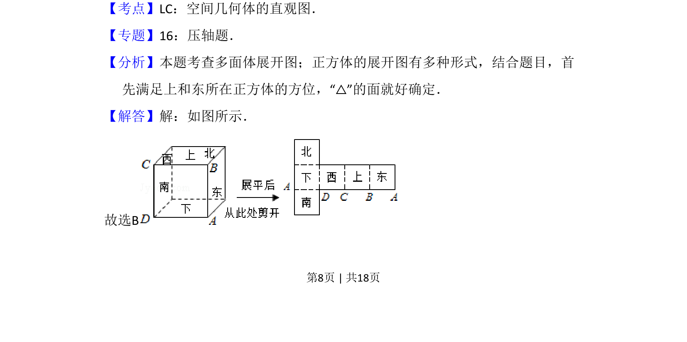
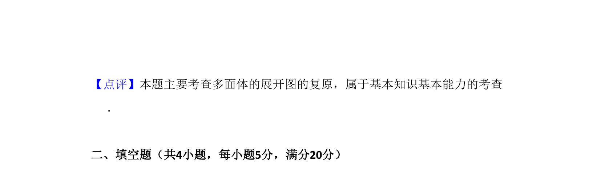

## 题面

## 摘要

将正方体展开图还原，根据已知方位判断标记“△”的面的方向。

## 关联考点

- [[1200-空间几何体的直观图|空间几何体的直观图]]
- [[966-正方体展开图|正方体展开图]]
- [[1053-空间想象|空间想象]]

## 答案与解析

> 📄 原 PDF 第 8 页：`素材/真题/吉林/2008-2024·（吉林）数学高考真题/2009年高考数学试卷（文）（全国卷Ⅱ）（解析卷）.pdf`
