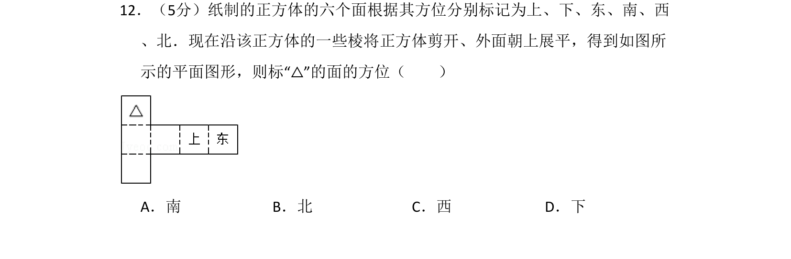
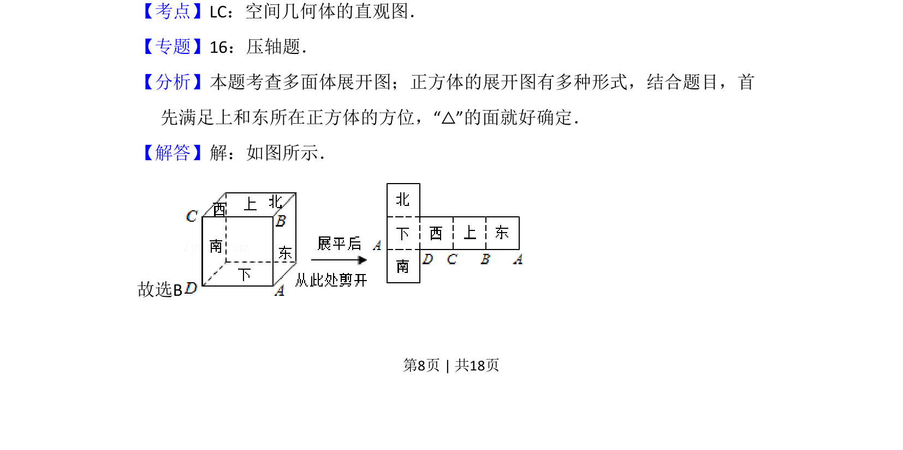
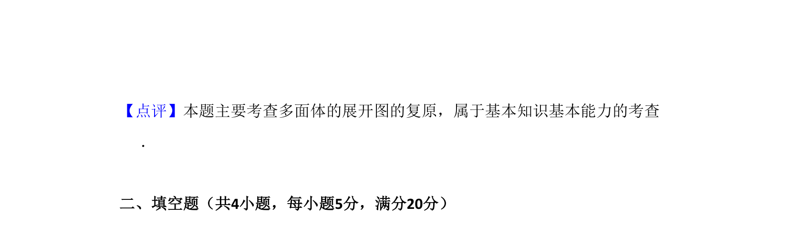

## 题面

## 摘要

将正方体展开图还原，根据已知方位判断标记“△”的面的方向。

## 关联考点

- [[1200-空间几何体的直观图|空间几何体的直观图]]
- [[966-正方体展开图|正方体展开图]]
- [[1053-空间想象|空间想象]]

## 答案与解析

> 📄 原 PDF 第 8 页：`素材/真题/吉林/2008-2024·（吉林）数学高考真题/2009年高考数学试卷（文）（全国卷Ⅱ）（解析卷）.pdf`

<!-- 题干文本-start -->
## 题干文本
12．（5分）纸制的正方体的六个面根据其方位分别标记为上、下、东、南、西
、北．现在沿该正方体的一些棱将正方体剪开、外面朝上展平，得到如图所
示的平面图形，则标“△”的面的方位（　　）
A．南B．北C．西D．下
<!-- 题干文本-end -->

<!-- 解析文本-start -->
## 解析文本
【考点】LC：空间几何体的直观图．菁优网版权所有
【专题】16：压轴题．
【分析】本题考查多面体展开图；正方体的展开图有多种形式，结合题目，首
先满足上和东所在正方体的方位，“△”的面就好确定．
【解答】解：如图所示．
故选B
<!-- 解析文本-end -->
