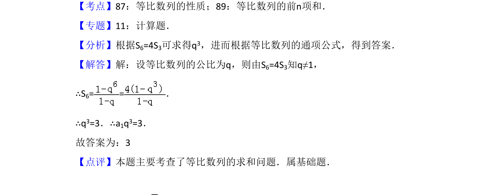

## 题面

## 摘要

本题根据等比数列前n项和的关系求公比，进而计算指定项的值。

## 关联考点

- [[357-等比数列前n项和|等比数列的前n项和]]
- [[1070-等比数列通项公式|等比数列的通项公式]]

## 答案与解析

> 📄 原 PDF 第 9 页：`素材/真题/吉林/2008-2024·（吉林）数学高考真题/2009年高考数学试卷（文）（全国卷Ⅱ）（解析卷）.pdf`

<!-- 题干文本-start -->
## 题干文本
13．（5分）设等比数列{an}的前n项和为Sn．若a1=1，S6=4S3，则a4=　3　．
<!-- 题干文本-end -->

<!-- 解析文本-start -->
## 解析文本
【考点】87：等比数列的性质；89：等比数列的前n项和．菁优网版权所有
【专题】11：计算题．
【分析】根据S6=4S3可求得q3，进而根据等比数列的通项公式，得到答案．
【解答】解：设等比数列的公比为q，则由S6=4S3知q≠1，
∴S6= =．
∴q3=3．∴a1q3=3．
故答案为：3
【点评】本题主要考查了等比数列的求和问题．属基础题．
<!-- 解析文本-end -->
