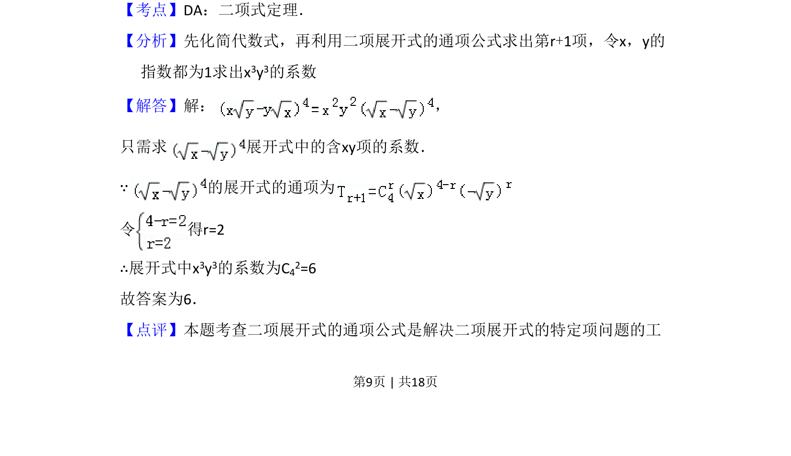

## 题面

## 摘要

求二项展开式中特定项的系数，利用通项公式确定指数并计算组合数。

## 关联考点

- [[472-二项式定理|二项式定理]]
- [[384-数列通项公式|通项公式]]
- [[504-组合数公式|组合数]]

## 答案与解析

> 📄 原 PDF 第 9 页：`素材/真题/吉林/2008-2024·（吉林）数学高考真题/2009年高考数学试卷（文）（全国卷Ⅱ）（解析卷）.pdf`
