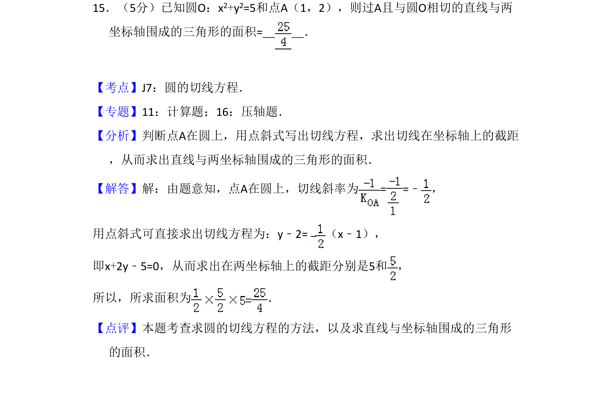
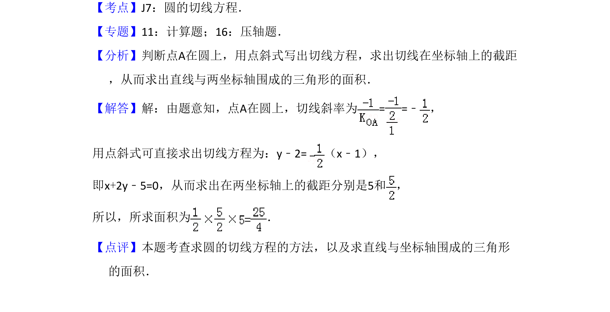

## 题面

## 摘要

求过圆上一点的切线方程并计算其与坐标轴围成的三角形面积

## 关联考点

- [[779-圆的切线方程|圆的切线方程]]
- [[1028-直线的截距|直线的截距]]
- [[062-多边形面积|三角形面积]]

## 答案与解析

> 📄 原 PDF 第 10 页：`素材/真题/吉林/2008-2024·（吉林）数学高考真题/2009年高考数学试卷（文）（全国卷Ⅱ）（解析卷）.pdf`
