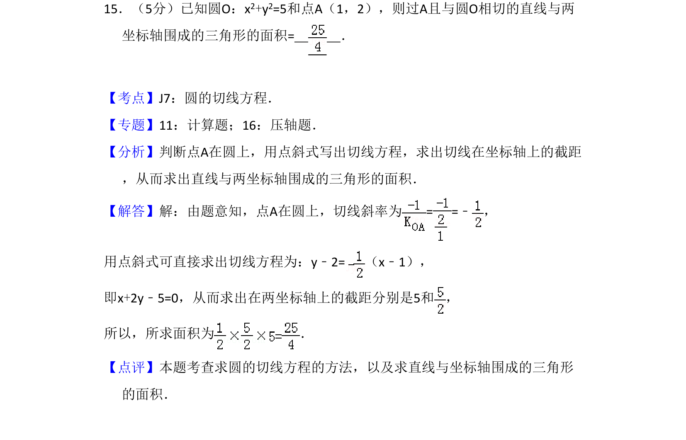
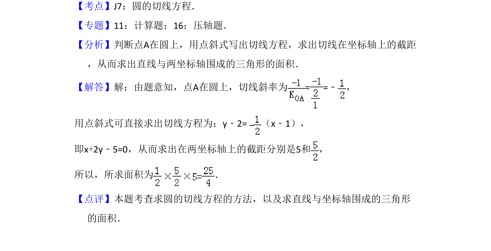

## 题面

## 摘要

求过圆上一点的切线方程并计算其与坐标轴围成的三角形面积

## 关联考点

- [[779-圆的切线方程|圆的切线方程]]
- [[1028-直线的截距|直线的截距]]
- [[062-多边形面积|三角形面积]]

## 答案与解析

> 📄 原 PDF 第 10 页：`素材/真题/吉林/2008-2024·（吉林）数学高考真题/2009年高考数学试卷（文）（全国卷Ⅱ）（解析卷）.pdf`

<!-- 题干文本-start -->
## 题干文本
15．（5分）已知圆O：x2+y2=5和点A（1，2），则过A且与圆O相切的直线与两
坐标轴围成的三角形的面积=　 　．
<!-- 题干文本-end -->

<!-- 解析文本-start -->
## 解析文本
【考点】J7：圆的切线方程．菁优网版权所有
【专题】11：计算题；16：压轴题．
【分析】判断点A在圆上，用点斜式写出切线方程，求出切线在坐标轴上的截距
，从而求出直线与两坐标轴围成的三角形的面积．
【解答】解：由题意知，点A在圆上，切线斜率为= =﹣ ，
用点斜式可直接求出切线方程为：y﹣2=（x﹣1），
即x+2y﹣5=0，从而求出在两坐标轴上的截距分别是5和 ，
所以，所求面积为 ．
【点评】本题考查求圆的切线方程的方法，以及求直线与坐标轴围成的三角形
的面积．
<!-- 解析文本-end -->
