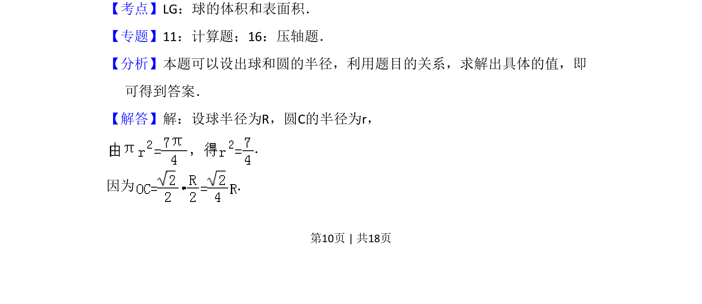
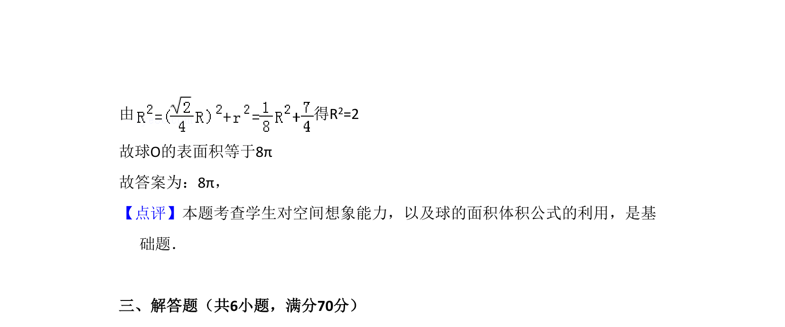

## 题面

## 摘要

该题考查球体被平面所截，利用截面圆半径、球半径及夹角关系求球的表面积。

## 关联考点

- [[993-球的表面积|球的表面积]]
- [[873-截面圆性质|截面圆性质]]
- [[1049-空间几何计算|空间几何计算]]

## 答案与解析

> 📄 原 PDF 第 10 页：`素材/真题/吉林/2008-2024·（吉林）数学高考真题/2009年高考数学试卷（文）（全国卷Ⅱ）（解析卷）.pdf`

<!-- 题干文本-start -->
## 题干文本
16．（5分）设OA是球O的半径，M是OA的中点，过M且与OA成45°角的平面截
球O的表面得到圆C．若圆C的面积等于 ，则球O的表面积等于　8π　．
<!-- 题干文本-end -->

<!-- 解析文本-start -->
## 解析文本
【考点】LG：球的体积和表面积．菁优网版权所有
【专题】11：计算题；16：压轴题．
【分析】本题可以设出球和圆的半径，利用题目的关系，求解出具体的值，即
可得到答案．
【解答】解：设球半径为R，圆C的半径为r，
．
因为 ．
<!-- 解析文本-end -->
