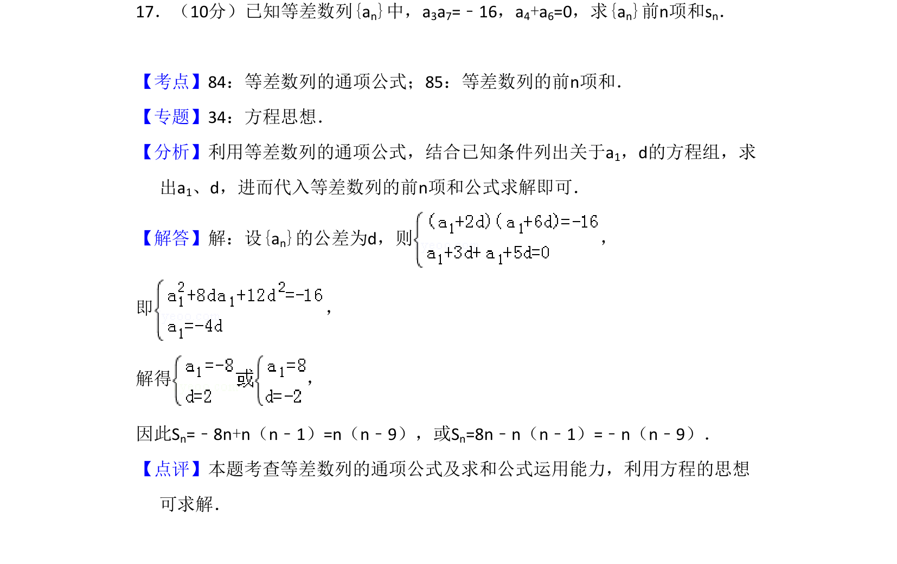
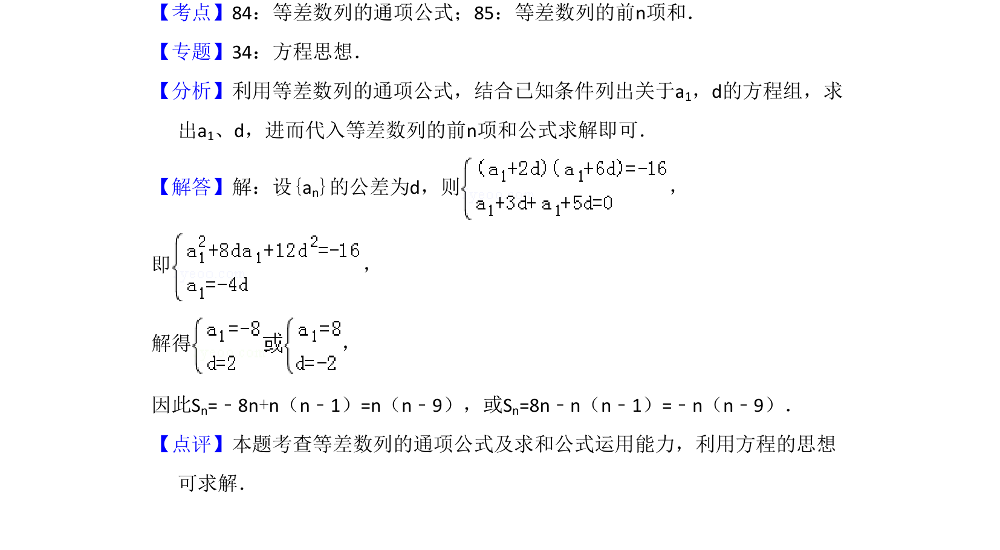

## 题面

## 摘要

已知等差数列的项间关系求前n项和，利用方程思想解出首项与公差。

## 关联考点

- [[1062-等差数列的通项公式|等差数列的通项公式]]
- [[1060-等差数列的前n项和|等差数列的前n项和]]
- [[906-方程思想|方程思想]]

## 答案与解析

> 📄 原 PDF 第 11 页：`素材/真题/吉林/2008-2024·（吉林）数学高考真题/2009年高考数学试卷（文）（全国卷Ⅱ）（解析卷）.pdf`
