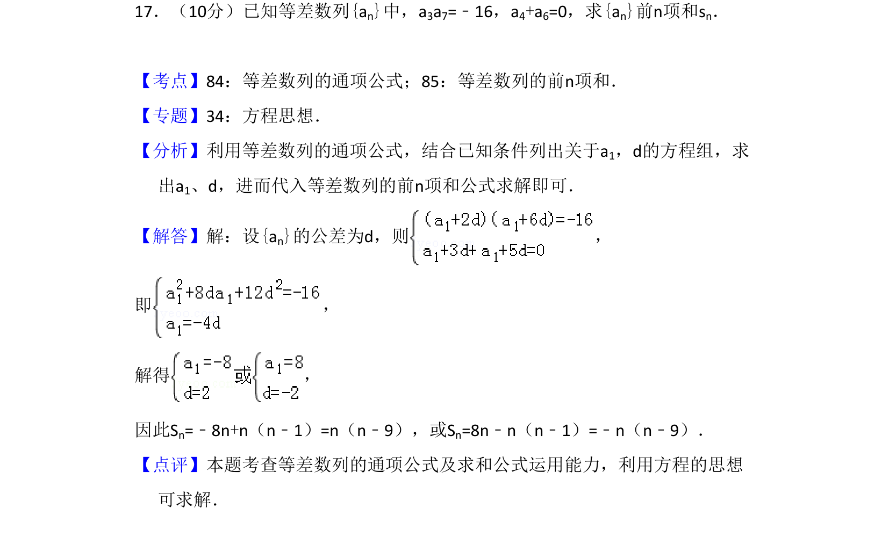
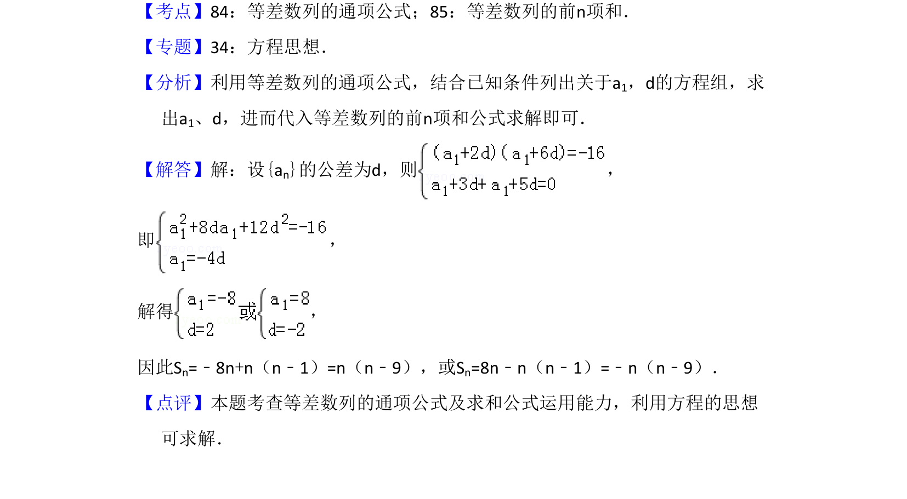

## 题面

## 摘要

已知等差数列的项间关系求前n项和，利用方程思想解出首项与公差。

## 关联考点

- [[1063-等差数列通项公式|等差数列的通项公式]]
- [[355-等差数列前n项和|等差数列的前n项和]]
- [[906-方程思想|方程思想]]

## 答案与解析

> 📄 原 PDF 第 11 页：`素材/真题/吉林/2008-2024·（吉林）数学高考真题/2009年高考数学试卷（文）（全国卷Ⅱ）（解析卷）.pdf`

<!-- 题干文本-start -->
## 题干文本
17．（10分）已知等差数列{an}中，a3a7=﹣16，a4+a6=0，求{an}前n项和sn．
<!-- 题干文本-end -->

<!-- 解析文本-start -->
## 解析文本
【考点】84：等差数列的通项公式；85：等差数列的前n项和．菁优网版权所有
【专题】34：方程思想．
【分析】利用等差数列的通项公式，结合已知条件列出关于a1，d的方程组，求
出a1、d，进而代入等差数列的前n项和公式求解即可．
【解答】解：设{an}的公差为d，则 ，
即 ，
解得 ，
因此Sn=﹣8n+n（n﹣1）=n（n﹣9），或Sn=8n﹣n（n﹣1）=﹣n（n﹣9）．
【点评】本题考查等差数列的通项公式及求和公式运用能力，利用方程的思想
可求解．
<!-- 解析文本-end -->
