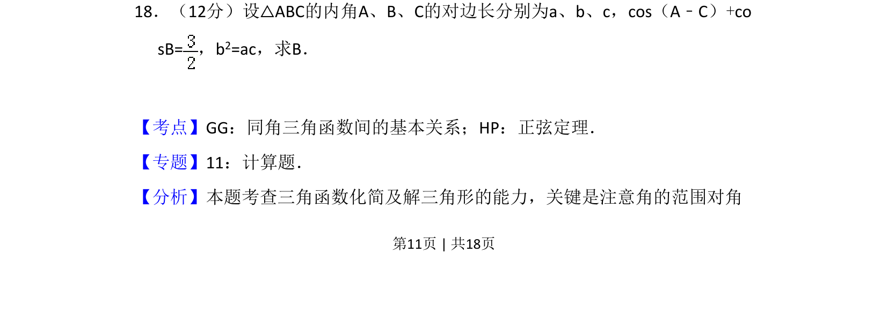
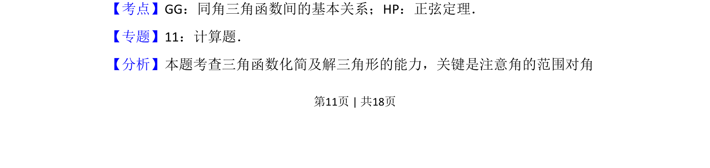
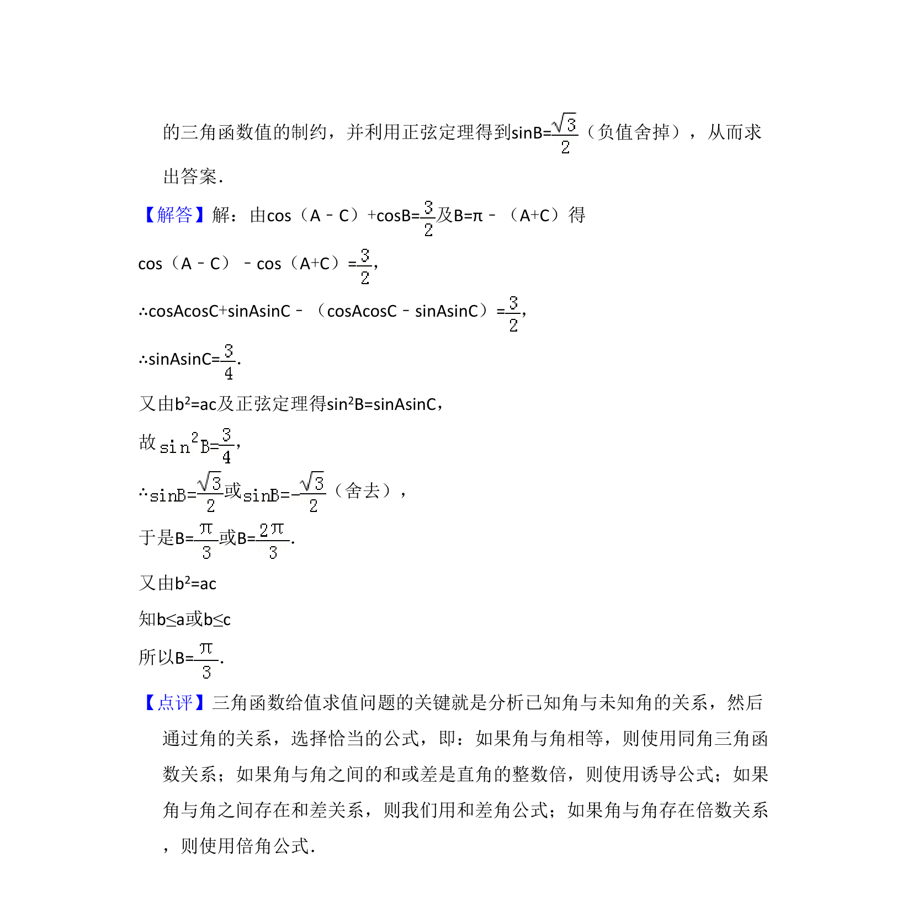

## 题面

## 摘要

已知△ABC中cos(A-C)+cosB=3/2且b²=ac，综合运用余弦定理与和差化积求角B。

## 关联考点

- [[126-定理|余弦定理]]
- [[274-两角和差正余弦|和差化积]]
- [[解三角形]]

## 答案与解析

> 📄 原 PDF 第 11 页：`素材/真题/吉林/2008-2024·（吉林）数学高考真题/2009年高考数学试卷（文）（全国卷Ⅱ）（解析卷）.pdf`
