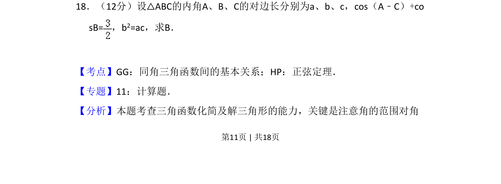
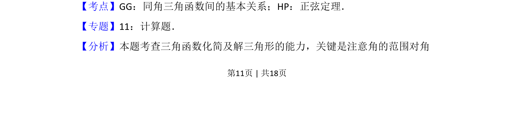
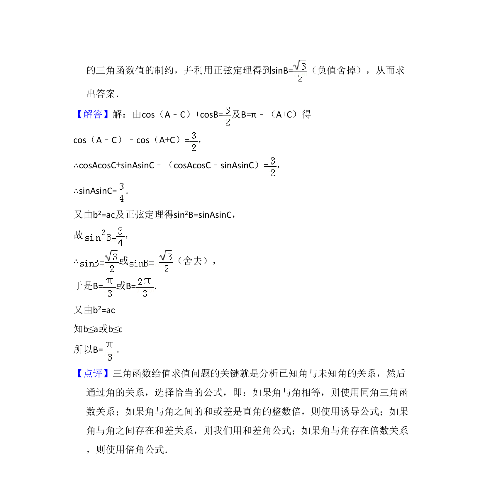

## 题面

## 摘要

已知△ABC中cos(A-C)+cosB=3/2且b²=ac，综合运用余弦定理与和差化积求角B。

## 关联考点

- [[126-定理|余弦定理]]
- [[274-两角和差正余弦|和差化积]]
- [[589-解三角形|解三角形]]

## 答案与解析

> 📄 原 PDF 第 11 页：`素材/真题/吉林/2008-2024·（吉林）数学高考真题/2009年高考数学试卷（文）（全国卷Ⅱ）（解析卷）.pdf`

<!-- 题干文本-start -->
## 题干文本
18．（12分）设△ABC的内角A、B、C的对边长分别为a、b、c，cos（A﹣C）+co
sB=，b 2=ac，求B．
<!-- 题干文本-end -->

<!-- 解析文本-start -->
## 解析文本
【考点】GG：同角三角函数间的基本关系；HP：正弦定理．菁优网版权所有
【专题】11：计算题．
【分析】本题考查三角函数化简及解三角形的能力，关键是注意角的范围对角
<!-- 解析文本-end -->
