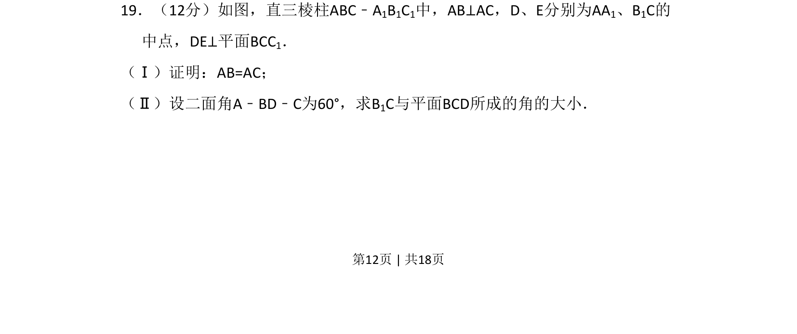

## 题面

## 摘要

证明线面垂直关系推导等腰三角形，利用二面角求线面角大小。

## 关联考点

- [[351-空间直线平面垂直|线面垂直]]
- [[353-空间角|二面角]]
- [[353-空间角|线面角]]
- [[401-空间向量基本概念|空间向量]]

## 答案与解析

> 📄 原 PDF 第 12 页：`素材/真题/吉林/2008-2024·（吉林）数学高考真题/2009年高考数学试卷（文）（全国卷Ⅱ）（解析卷）.pdf`
