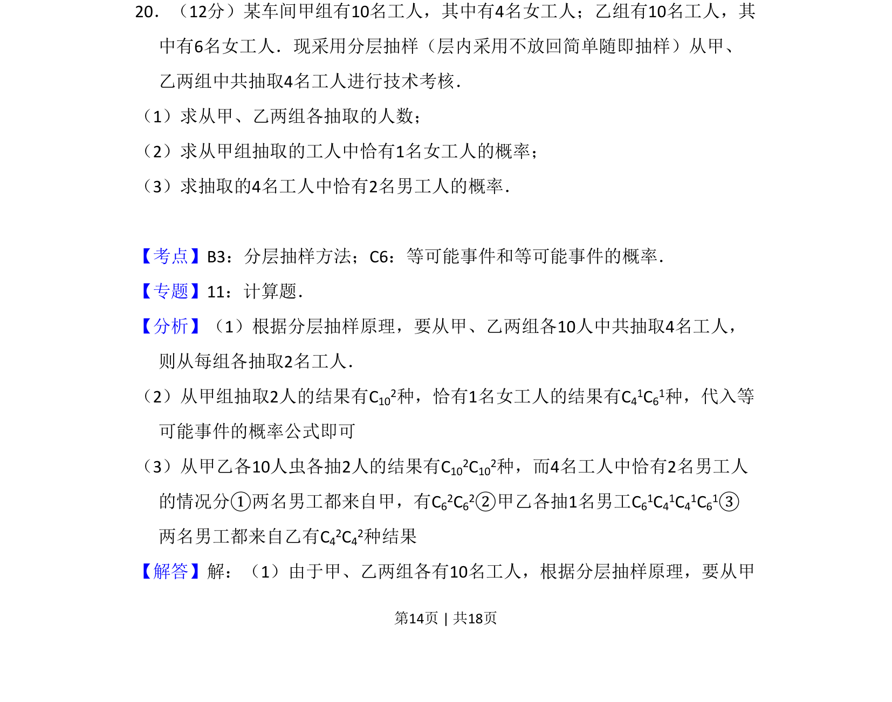
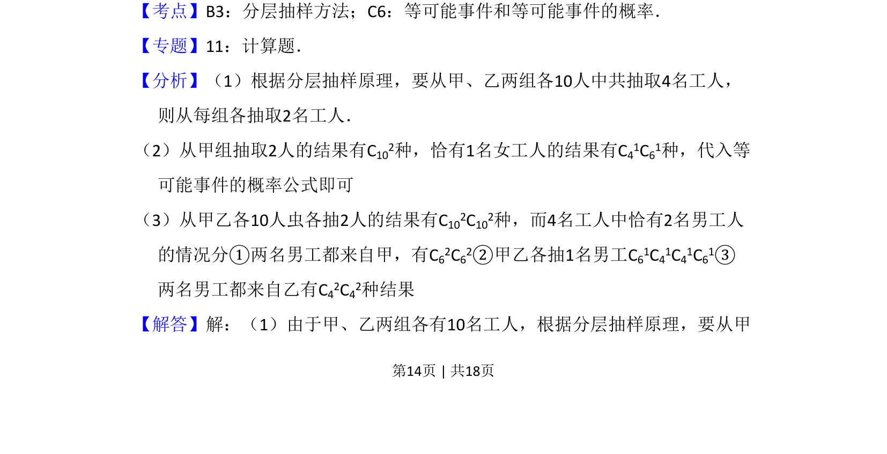
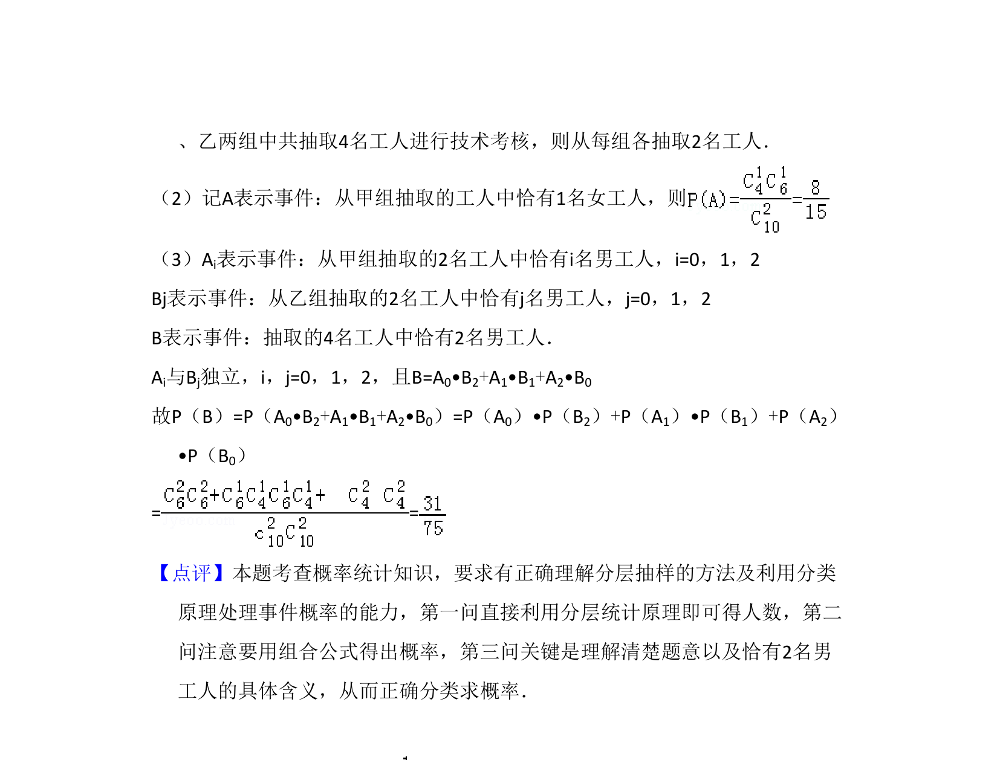

## 题面

## 摘要

本题通过分层抽样抽取工人，计算恰有指定性别人数的概率。

## 关联考点

- [[319-分层抽样|分层抽样]]
- [[1058-等可能事件概率|等可能事件概率]]
- [[1090-组合计数|组合计数]]

## 答案与解析

> 📄 原 PDF 第 14 页：`素材/真题/吉林/2008-2024·（吉林）数学高考真题/2009年高考数学试卷（文）（全国卷Ⅱ）（解析卷）.pdf`

<!-- 题干文本-start -->
## 题干文本
20．（12分）某车间甲组有10名工人，其中有4名女工人；乙组有10名工人，其
中有6名女工人．现采用分层抽样（层内采用不放回简单随即抽样）从甲、
乙两组中共抽取4名工人进行技术考核．
（1）求从甲、乙两组各抽取的人数；
（2）求从甲组抽取的工人中恰有1名女工人的概率；
（3）求抽取的4名工人中恰有2名男工人的概率．
<!-- 题干文本-end -->

<!-- 解析文本-start -->
## 解析文本
【考点】B3：分层抽样方法；C6：等可能事件和等可能事件的概率．菁优网版权所有
【专题】11：计算题．
【分析】（1）根据分层抽样原理，要从甲、乙两组各10人中共抽取4名工人，
则从每组各抽取2名工人．
（2）从甲组抽取2人的结果有C102种，恰有1名女工人的结果有C41C61种，代入等
可能事件的概率公式即可
（3）从甲乙各10人虫各抽2人的结果有C102C102种，而4名工人中恰有2名男工人
的情况分①两名男工都来自甲，有C62C62②甲乙各抽1名男工C61C41C41C61③
两名男工都来自乙有C42C42种结果
【解答】解：（1）由于甲、乙两组各有10名工人，根据分层抽样原理，要从甲
<!-- 解析文本-end -->
