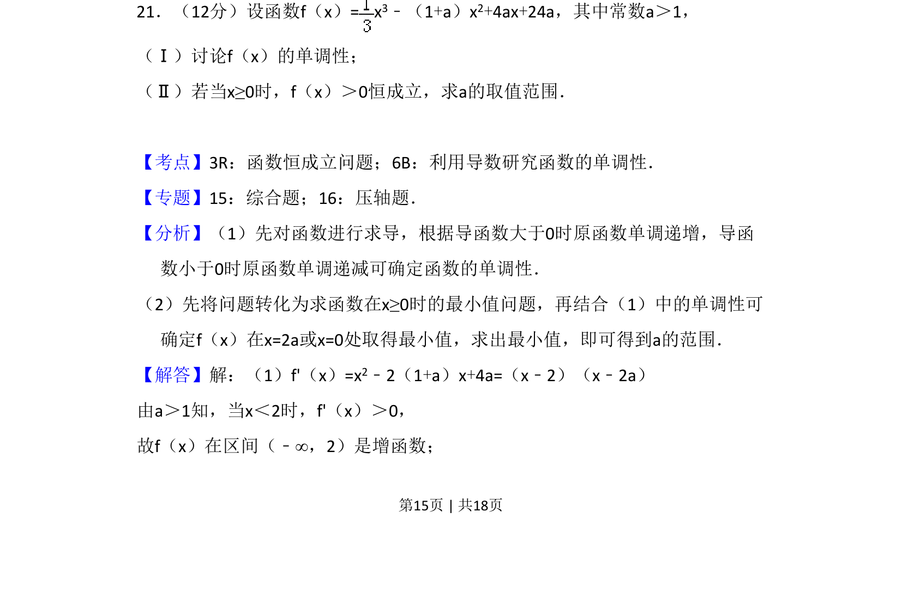
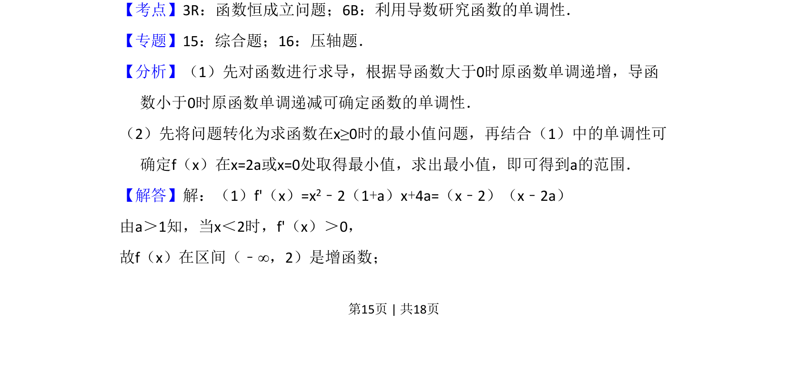
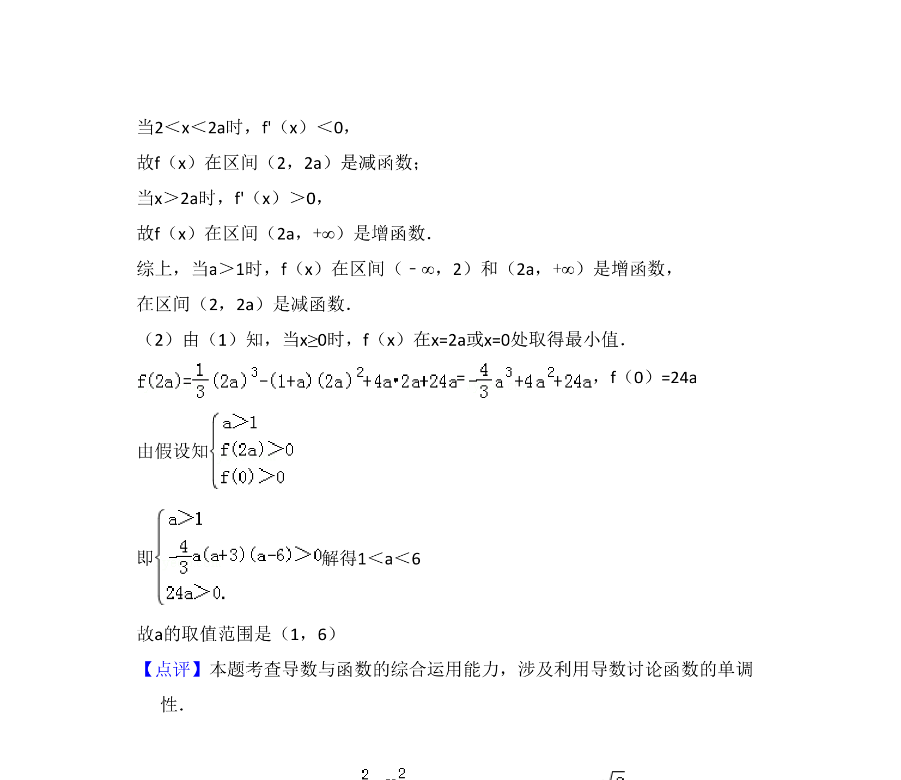

## 题面

## 摘要

该题考查含参三次函数单调性讨论及不等式恒成立求参数范围，需结合导数与分类讨论。

## 关联考点

- [[536-函数恒成立问题|函数恒成立问题]]
- [[705-利用导数研究函数的单调性|利用导数研究函数的单调性]]
- [[424-参数分类讨论|分类讨论]]

## 答案与解析

> 📄 原 PDF 第 15 页：`素材/真题/吉林/2008-2024·（吉林）数学高考真题/2009年高考数学试卷（文）（全国卷Ⅱ）（解析卷）.pdf`
