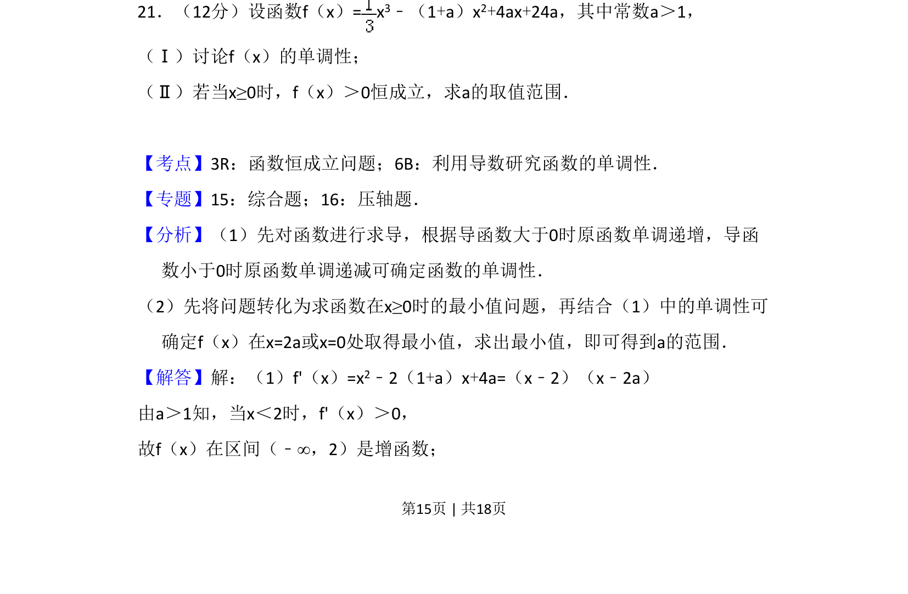
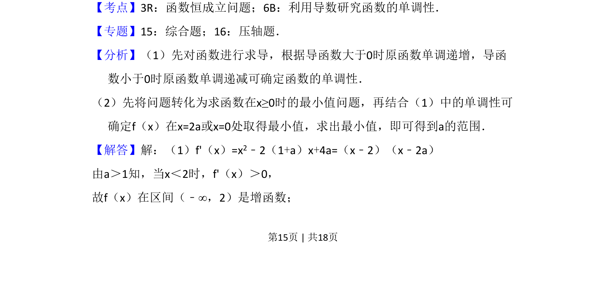
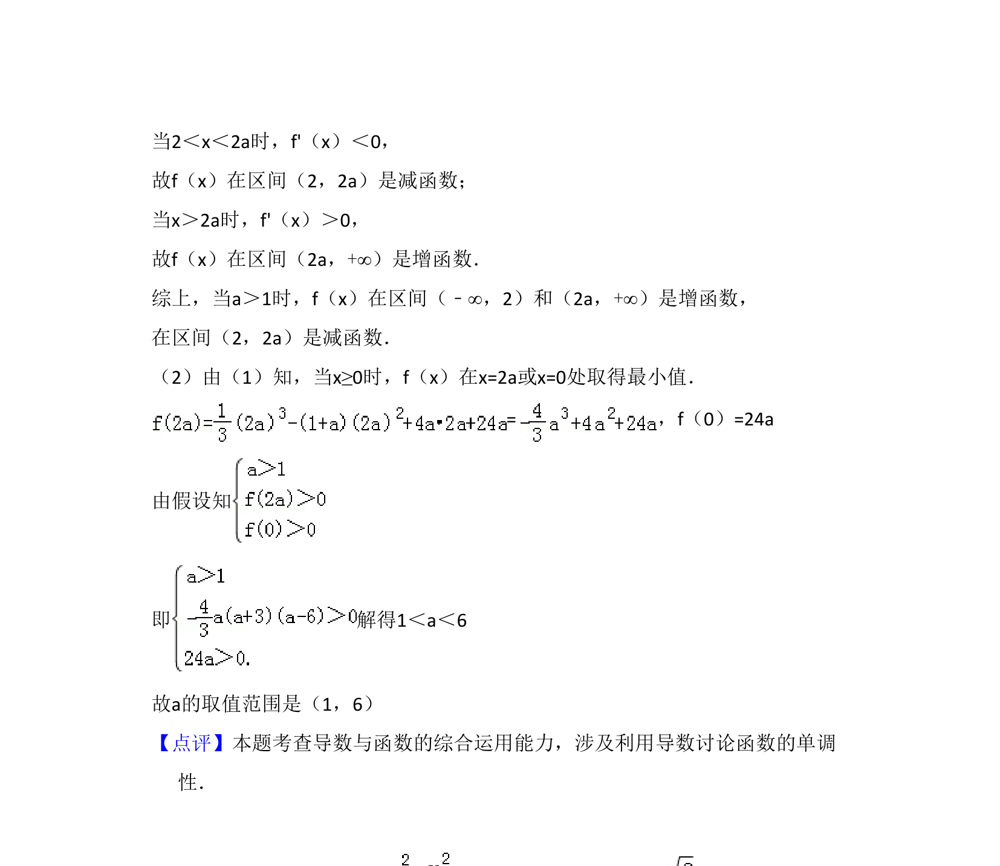

## 题面

## 摘要

该题考查含参三次函数单调性讨论及不等式恒成立求参数范围，需结合导数与分类讨论。

## 关联考点

- [[536-函数恒成立问题|函数恒成立问题]]
- [[705-利用导数研究函数的单调性|利用导数研究函数的单调性]]
- [[424-参数分类讨论|分类讨论]]

## 答案与解析

> 📄 原 PDF 第 15 页：`素材/真题/吉林/2008-2024·（吉林）数学高考真题/2009年高考数学试卷（文）（全国卷Ⅱ）（解析卷）.pdf`

<!-- 题干文本-start -->
## 题干文本
21．（12分）设函数f（x）= x 3﹣（1+a）x2+4ax+24a，其中常数a＞1，
（Ⅰ）讨论f（x）的单调性；
（Ⅱ）若当x≥0时，f（x）＞0恒成立，求a的取值范围．
<!-- 题干文本-end -->

<!-- 解析文本-start -->
## 解析文本
【考点】3R：函数恒成立问题；6B：利用导数研究函数的单调性．菁优网版权所有
【专题】15：综合题；16：压轴题．
【分析】（1）先对函数进行求导，根据导函数大于0时原函数单调递增，导函
数小于0时原函数单调递减可确定函数的单调性．
（2）先将问题转化为求函数在x≥0时的最小值问题，再结合（1）中的单调性可
确定f（x）在x=2a或x=0处取得最小值，求出最小值，即可得到a的范围．
【解答】解：（1）f'（x）=x2﹣2（1+a）x+4a=（x﹣2）（x﹣2a）
由a＞1知，当x＜2时，f'（x）＞0，
故f（x）在区间（﹣∞，2）是增函数；
<!-- 解析文本-end -->
