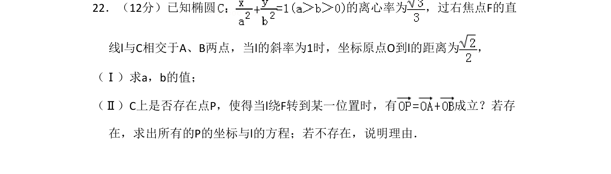
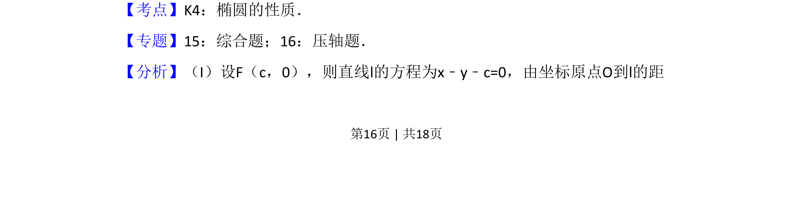

## 题面

## 摘要

考查椭圆离心率、点到直线距离公式及存在性问题，求椭圆参数和满足向量条件的点与直线。

## 关联考点

- [[椭圆的性质]]
- [[点到直线距离]]
- [[向量运算]]
- [[428-存在性问题|存在性问题]]

## 答案与解析

> 📄 原 PDF 第 16 页：`素材/真题/吉林/2008-2024·（吉林）数学高考真题/2009年高考数学试卷（文）（全国卷Ⅱ）（解析卷）.pdf`
