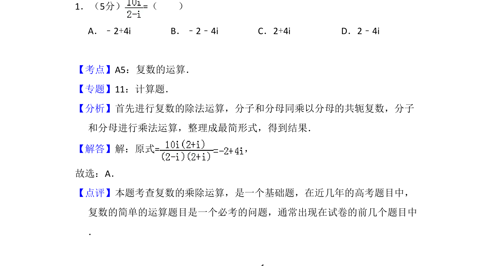
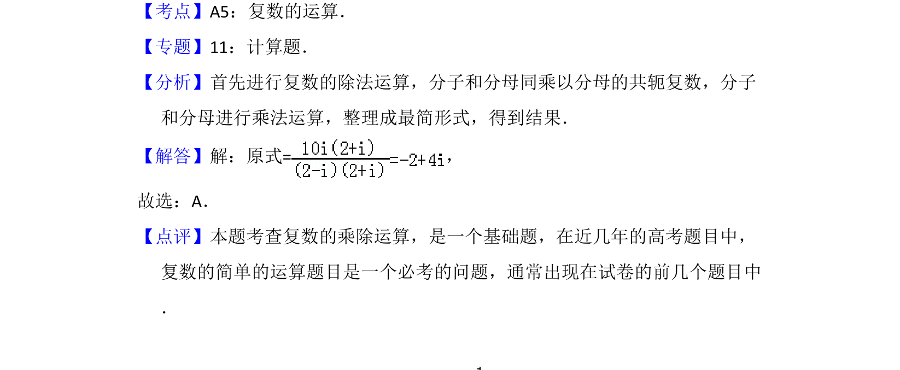

## 题面

## 摘要

复数除法运算，分子分母同乘共轭复数化简为标准形式

## 关联考点

- [[811-复数运算|复数运算]]
- [[332-复数的乘除运算|复数除法]]
- [[534-共轭复数|共轭复数]]

## 答案与解析

> 📄 原 PDF 第 1 页：`素材/真题/吉林/2008-2024·（吉林）数学高考真题/2009年高考数学试卷（理）（全国卷Ⅱ）（解析卷）.pdf`
