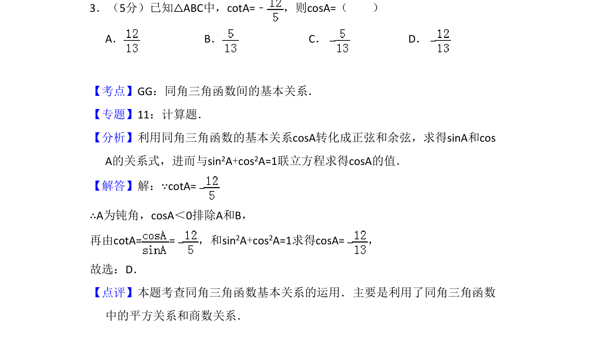
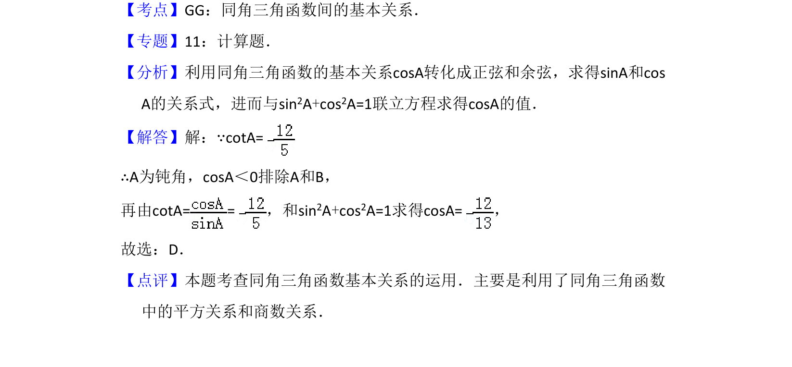

## 题面

## 摘要

已知cotA的值求cosA，运用同角三角函数基本关系及平方关系求解。

## 关联考点

- [[741-同角三角函数基本关系|同角三角函数基本关系]]
- [[1155-平方关系|平方关系]]
- [[1154-商数关系|商数关系]]

## 答案与解析

> 📄 原 PDF 第 2 页：`素材/真题/吉林/2008-2024·（吉林）数学高考真题/2009年高考数学试卷（理）（全国卷Ⅱ）（解析卷）.pdf`

<!-- 题干文本-start -->
## 题干文本
3．（5分）已知△ABC中，cotA=﹣ ，则cosA=（　　）
A．B．C．D．
<!-- 题干文本-end -->

<!-- 解析文本-start -->
## 解析文本
【考点】GG：同角三角函数间的基本关系．菁优网版权所有
【专题】11：计算题．
【分析】利用同角三角函数的基本关系cosA转化成正弦和余弦，求得sinA和cos
A的关系式，进而与sin2A+cos2A=1联立方程求得cosA的值．
【解答】解：∵cotA=
∴A为钝角，cosA＜0排除A和B，
再由cotA= =，和sin 2A+cos2A=1求得cosA=，
故选：D．
【点评】本题考查同角三角函数基本关系的运用．主要是利用了同角三角函数
中的平方关系和商数关系．
<!-- 解析文本-end -->
