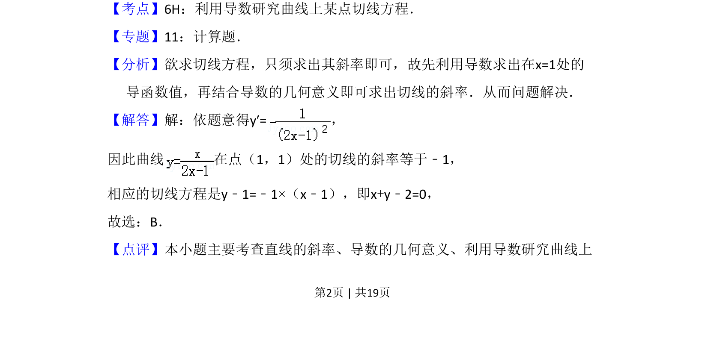

## 题面

## 摘要

利用导数求函数在点(1,1)处的切线斜率与方程

## 关联考点

- [[425-反函数导数|导数]]
- [[422-切线方程|切线方程]]
- [[440-导数的几何意义|导数的几何意义]]

## 答案与解析

> 📄 原 PDF 第 2 页：`素材/真题/吉林/2008-2024·（吉林）数学高考真题/2009年高考数学试卷（理）（全国卷Ⅱ）（解析卷）.pdf`
