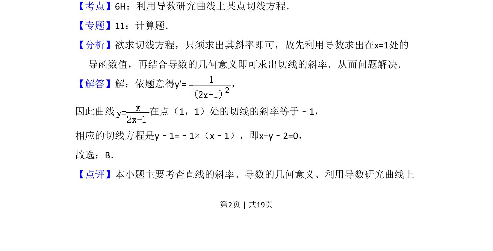

## 题面

## 摘要

利用导数求函数在点(1,1)处的切线斜率与方程

## 关联考点

- [[425-反函数导数|导数]]
- [[422-切线方程|切线方程]]
- [[440-导数的几何意义|导数的几何意义]]

## 答案与解析

> 📄 原 PDF 第 2 页：`素材/真题/吉林/2008-2024·（吉林）数学高考真题/2009年高考数学试卷（理）（全国卷Ⅱ）（解析卷）.pdf`

<!-- 题干文本-start -->
## 题干文本
4．（5分）函数 在点（1，1）处的切线方程为（　　）
A．x﹣y﹣2=0 B．x+y﹣2=0 C．x+4y﹣5=0 D．x﹣4y+3=0
<!-- 题干文本-end -->

<!-- 解析文本-start -->
## 解析文本
【考点】6H：利用导数研究曲线上某点切线方程．菁优网版权所有
【专题】11：计算题．
【分析】欲求切线方程，只须求出其斜率即可，故先利用导数求出在x=1处的
导函数值，再结合导数的几何意义即可求出切线的斜率．从而问题解决．
【解答】解：依题意得y′=，
因此曲线 在点（1，1）处的切线的斜率等于﹣1，
相应的切线方程是y﹣1=﹣1×（x﹣1），即x+y﹣2=0，
故选：B．
【点评】本小题主要考查直线的斜率、导数的几何意义、利用导数研究曲线上
<!-- 解析文本-end -->
