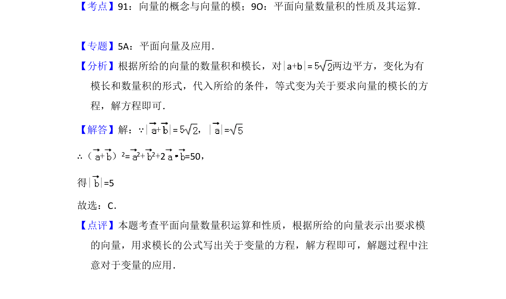

## 题面

## 摘要

已知向量坐标、数量积及向量和的模，求另一向量的模。

## 关联考点

- [[752-向量模长|向量的模]]
- [[854-平面向量数量积|平面向量数量积]]
- [[757-向量运算|向量运算]]

## 答案与解析

> 📄 原 PDF 第 4 页：`素材/真题/吉林/2008-2024·（吉林）数学高考真题/2009年高考数学试卷（理）（全国卷Ⅱ）（解析卷）.pdf`

<!-- 题干文本-start -->
## 题干文本
6．（5分）已知向量=（2，1），=10，| + |=，则| |=（　　）
A．B．C．5 D．25
<!-- 题干文本-end -->

<!-- 解析文本-start -->
## 解析文本
【考点】91：向量的概念与向量的模；9O：平面向量数量积的性质及其运算．菁优网版
权所有
【专题】5A：平面向量及应用．
【分析】根据所给的向量的数量积和模长，对|a+b|=两边平方，变化为有
模长和数量积的形式，代入所给的条件，等式变为关于要求向量的模长的方
程，解方程即可．
【解答】解：∵| + |=，| |=
∴（+） 2= 2+ 2+2 =50，
得| |=5
故选：C．
【点评】本题考查平面向量数量积运算和性质，根据所给的向量表示出要求模
的向量，用求模长的公式写出关于变量的方程，解方程即可，解题过程中注
意对于变量的应用．
<!-- 解析文本-end -->
