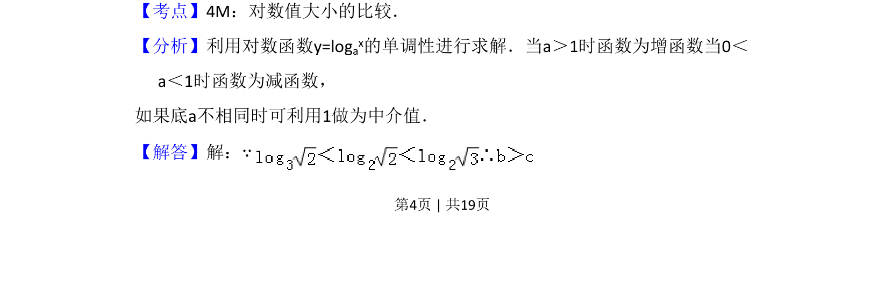
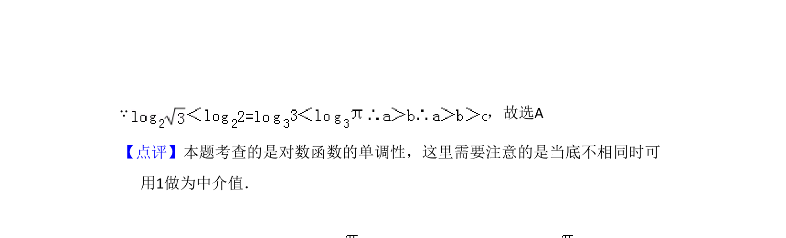

## 题面

## 摘要

比较对数式大小，利用单调性及中介值。

## 关联考点

- [[1162-对数值大小比较|对数值大小比较]]
- [[827-对数函数单调性|对数函数单调性]]

## 答案与解析

> 📄 原 PDF 第 4 页：`素材/真题/吉林/2008-2024·（吉林）数学高考真题/2009年高考数学试卷（理）（全国卷Ⅱ）（解析卷）.pdf`

<!-- 题干文本-start -->
## 题干文本
7．（5分）设a=log3π，b=log2 ，c=log3 ，则（　　）
A．a＞b＞c B．a＞c＞b C．b＞a＞c D．b＞c＞a
<!-- 题干文本-end -->

<!-- 解析文本-start -->
## 解析文本
【考点】4M：对数值大小的比较．菁优网版权所有
【分析】利用对数函数y=logax的单调性进行求解．当a＞1时函数为增函数当0＜
a＜1时函数为减函数，
如果底a不相同时可利用1做为中介值．
【解答】解：∵
<!-- 解析文本-end -->
