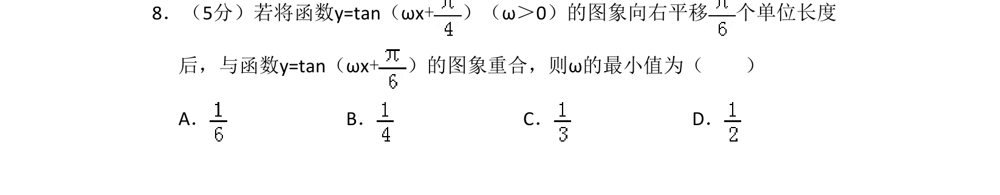
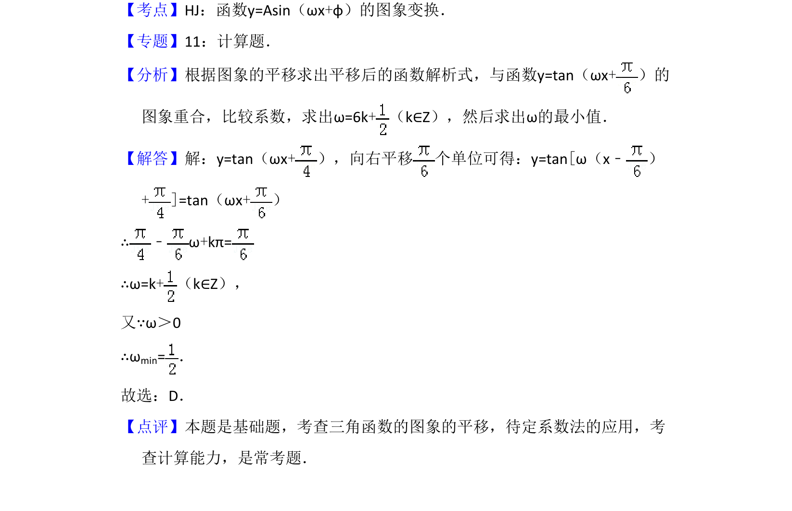

## 题面

## 摘要

本题考查正切型函数图象的平移变换及利用图象重合求参数的最小值。

## 关联考点

- [[269-三角函数图象变换|三角函数图象变换]]
- [[197-待定系数法|待定系数法]]
- [[308-正切函数图象与性质|正切函数]]

## 答案与解析

> 📄 原 PDF 第 5 页：`素材/真题/吉林/2008-2024·（吉林）数学高考真题/2009年高考数学试卷（理）（全国卷Ⅱ）（解析卷）.pdf`
