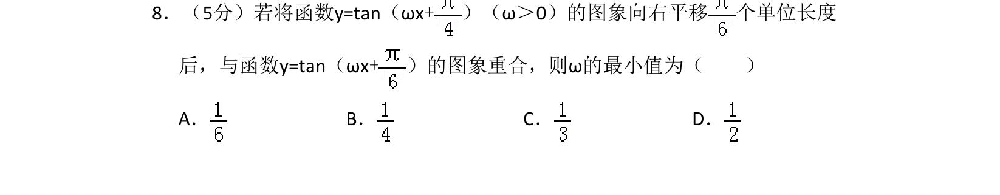
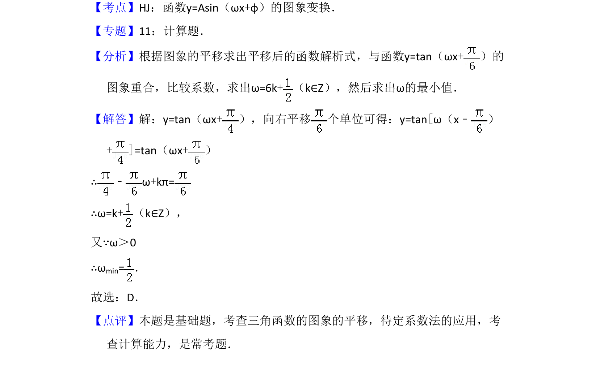

## 题面

## 摘要

本题考查正切型函数图象的平移变换及利用图象重合求参数的最小值。

## 关联考点

- [[269-三角函数图象变换|三角函数图象变换]]
- [[197-待定系数法|待定系数法]]
- [[308-正切函数图象与性质|正切函数]]

## 答案与解析

> 📄 原 PDF 第 5 页：`素材/真题/吉林/2008-2024·（吉林）数学高考真题/2009年高考数学试卷（理）（全国卷Ⅱ）（解析卷）.pdf`

<!-- 题干文本-start -->
## 题干文本
8．（5分）若将函数y=tan（ωx+）（ω＞0）的图象向右平移 个单位长度
后，与函数y=tan（ωx+）的图象重合，则ω的最小值为（　　）
A．B．C．D．
<!-- 题干文本-end -->

<!-- 解析文本-start -->
## 解析文本
【考点】HJ：函数y=Asin（ωx+φ）的图象变换．菁优网版权所有
【专题】11：计算题．
【分析】根据图象的平移求出平移后的函数解析式，与函数y=tan（ωx+）的
图象重合，比较系数，求出ω=6k+（k∈Z），然后求出ω的最小值．
【解答】解：y=tan（ωx+），向右平移 个单位可得：y=tan[ω（x﹣ ）
+ ]=tan（ωx+）
∴﹣ω+kπ=
∴ω=k+（k∈Z），
又∵ω＞0
∴ωmin=．
故选：D．
【点评】本题是基础题，考查三角函数的图象的平移，待定系数法的应用，考
查计算能力，是常考题．
<!-- 解析文本-end -->
