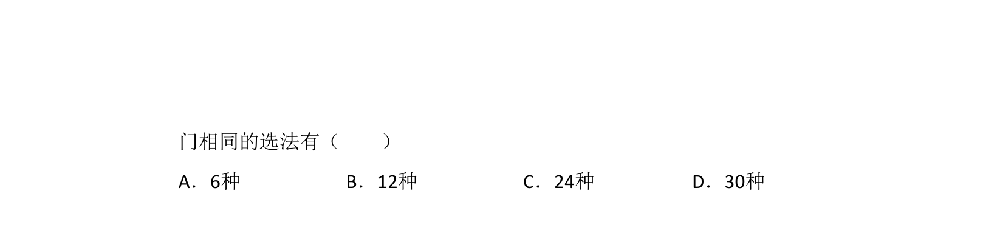
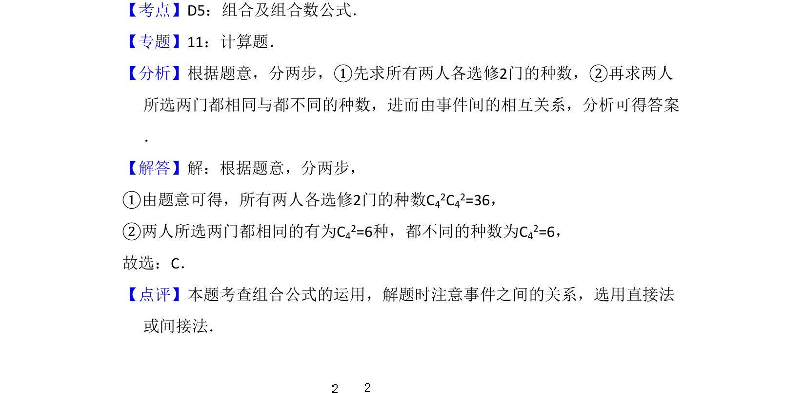

## 题面

## 摘要

甲、乙两人从4门课程中各选修2门，求恰有1门课程相同的选法数。

## 关联考点

- [[1090-组合计数|组合计数]]
- [[478-分类计数原理|分类加法原理]]
- [[477-分步计数原理|分步乘法原理]]

## 答案与解析

> 📄 原 PDF 第 6 页：`素材/真题/吉林/2008-2024·（吉林）数学高考真题/2009年高考数学试卷（理）（全国卷Ⅱ）（解析卷）.pdf`
