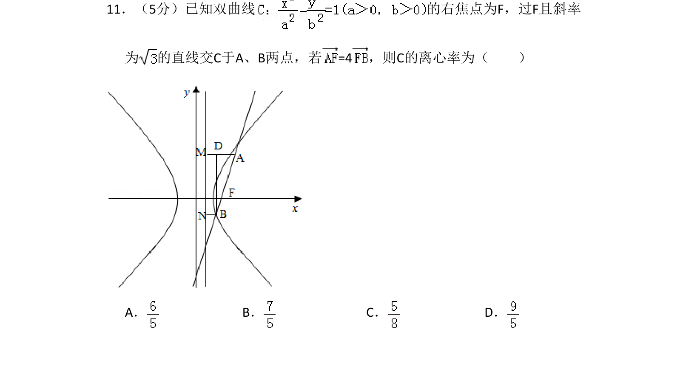
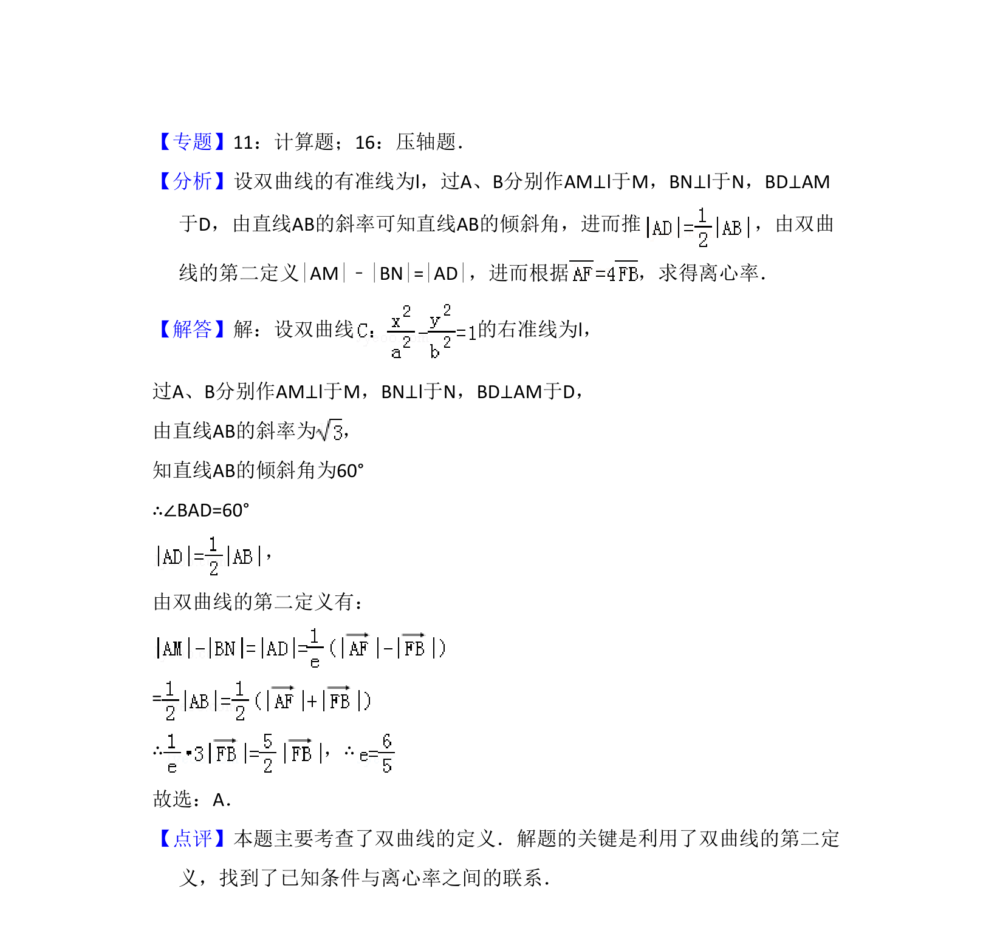

## 题面

## 摘要

已知双曲线右焦点作斜率为某值的直线交曲线于两点，由向量关系求离心率。

## 关联考点

- [[730-双曲线的定义|双曲线的定义]]
- [[1030-直线的斜率|直线的斜率]]
- [[736-双曲线的离心率|双曲线的离心率]]

## 答案与解析

> 📄 原 PDF 第 7 页：`素材/真题/吉林/2008-2024·（吉林）数学高考真题/2009年高考数学试卷（理）（全国卷Ⅱ）（解析卷）.pdf`
