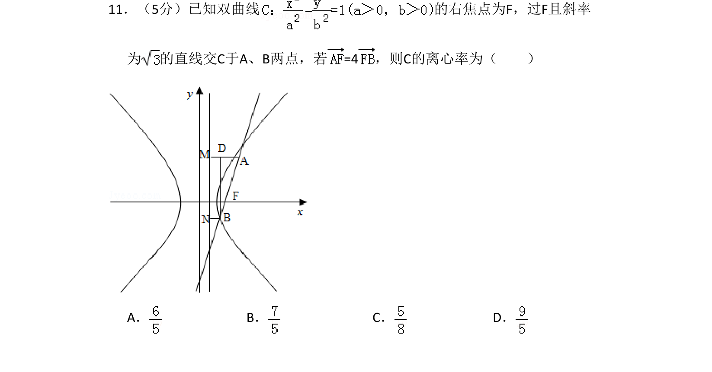
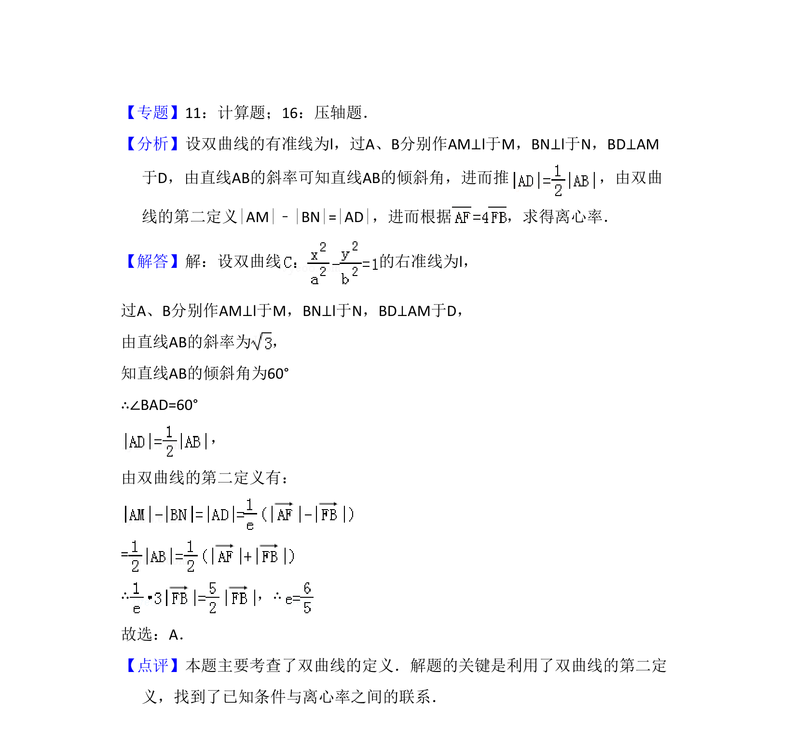

## 题面

## 摘要

已知双曲线右焦点作斜率为某值的直线交曲线于两点，由向量关系求离心率。

## 关联考点

- [[730-双曲线的定义|双曲线的定义]]
- [[1029-直线的斜率|直线的斜率]]
- [[736-双曲线的离心率|双曲线的离心率]]

## 答案与解析

> 📄 原 PDF 第 7 页：`素材/真题/吉林/2008-2024·（吉林）数学高考真题/2009年高考数学试卷（理）（全国卷Ⅱ）（解析卷）.pdf`

<!-- 题干文本-start -->
## 题干文本
11．（5分）已知双曲线 的右焦点为F，过F且斜率
为 的直线交C于A、B两点，若=4，则C的离心率为（　　）
A．B．C．D．
<!-- 题干文本-end -->

<!-- 解析文本-start -->
## 解析文本
【考点】I3：直线的斜率；KA：双曲线的定义．菁优网版权所有
<!-- 解析文本-end -->
