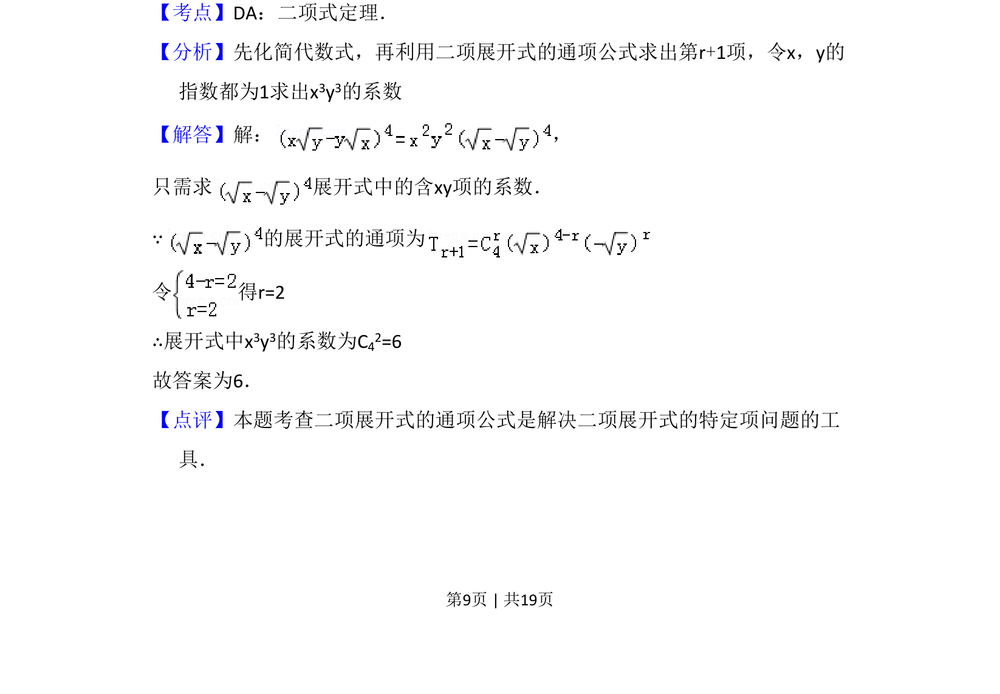

## 题面

## 摘要

求展开式中特定项的系数，利用通项公式确定指数。

## 关联考点

- [[472-二项式定理|二项式定理]]
- [[1160-展开式通项|展开式通项]]
- [[504-组合数公式|组合数]]

## 答案与解析

> 📄 原 PDF 第 9 页：`素材/真题/吉林/2008-2024·（吉林）数学高考真题/2009年高考数学试卷（理）（全国卷Ⅱ）（解析卷）.pdf`

<!-- 题干文本-start -->
## 题干文本
13．（5分）（x﹣y） 4的展开式中x3y3的系数为　6　．
<!-- 题干文本-end -->

<!-- 解析文本-start -->
## 解析文本
【考点】DA：二项式定理．菁优网版权所有
【分析】先化简代数式，再利用二项展开式的通项公式求出第r+1项，令x，y的
指数都为1求出x3y3的系数
【解答】解： ，
只需求 展开式中的含xy项的系数．
∵的展开式的通项为
令 得r=2
∴展开式中x3y3的系数为C42=6
故答案为6．
【点评】本题考查二项展开式的通项公式是解决二项展开式的特定项问题的工
具．
<!-- 解析文本-end -->
