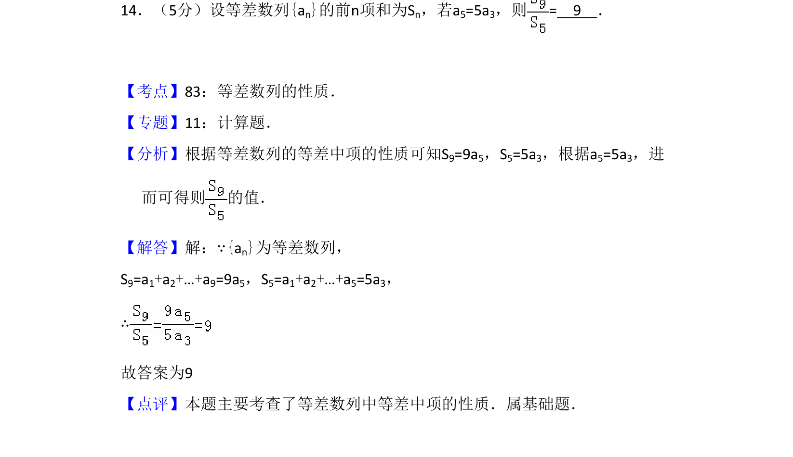
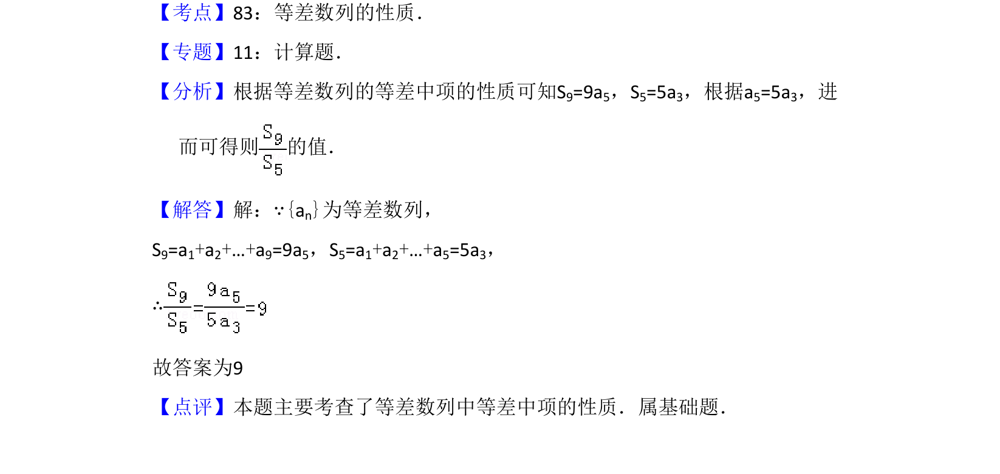

## 题面

## 摘要

本题利用等差数列的等差中项性质，由条件a5=5a3求S9与S5的比值。

## 关联考点

- [[356-等差数列概念|等差数列]]
- [[580-等差中项性质|等差中项性质]]
- [[355-等差数列前n项和|前n项和]]

## 答案与解析

> 📄 原 PDF 第 10 页：`素材/真题/吉林/2008-2024·（吉林）数学高考真题/2009年高考数学试卷（理）（全国卷Ⅱ）（解析卷）.pdf`
