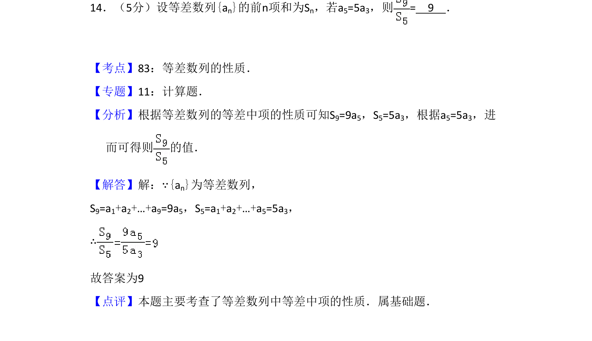
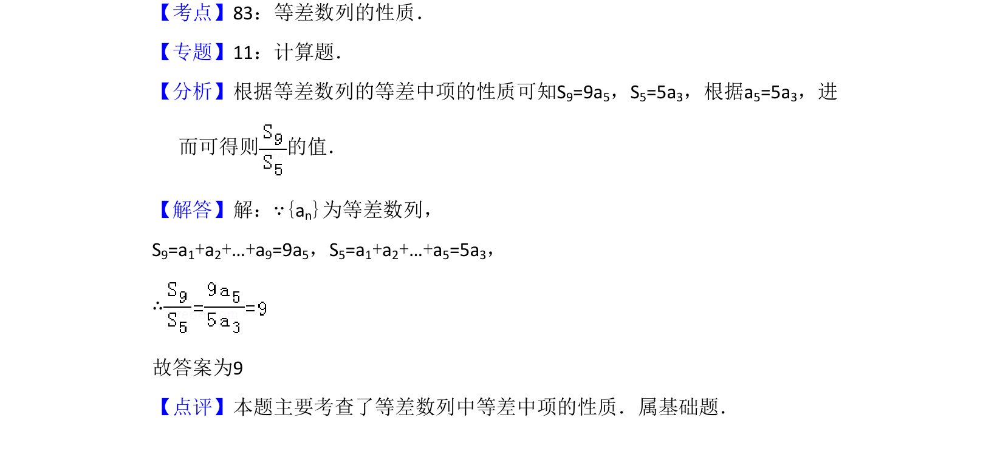

## 题面

## 摘要

本题利用等差数列的等差中项性质，由条件a5=5a3求S9与S5的比值。

## 关联考点

- [[356-等差数列概念|等差数列]]
- [[580-等差中项性质|等差中项性质]]
- [[355-等差数列前n项和|前n项和]]

## 答案与解析

> 📄 原 PDF 第 10 页：`素材/真题/吉林/2008-2024·（吉林）数学高考真题/2009年高考数学试卷（理）（全国卷Ⅱ）（解析卷）.pdf`

<!-- 题干文本-start -->
## 题干文本
14．（5分）设等差数列{an}的前n项和为Sn，若a5=5a3，则=　9　．
<!-- 题干文本-end -->

<!-- 解析文本-start -->
## 解析文本
【考点】83：等差数列的性质．菁优网版权所有
【专题】11：计算题．
【分析】根据等差数列的等差中项的性质可知S9=9a5，S5=5a3，根据a5=5a3，进
而可得则 的值．
【解答】解：∵{an}为等差数列，
S9=a1+a2+…+a9=9a5，S5=a1+a2+…+a5=5a3，
∴
故答案为9
【点评】本题主要考查了等差数列中等差中项的性质．属基础题．
<!-- 解析文本-end -->
