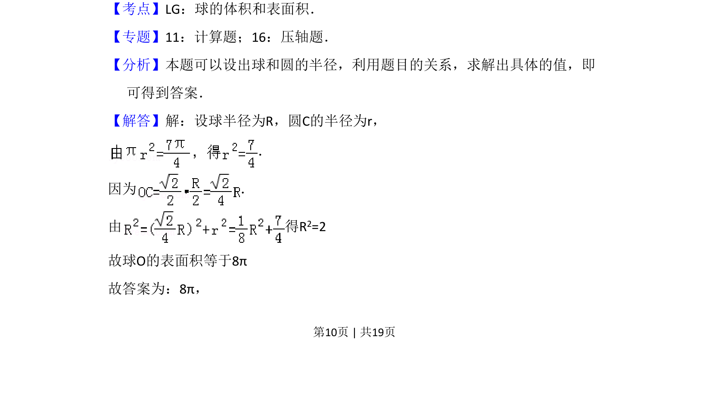
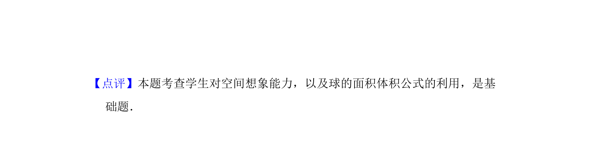

## 题面

## 摘要

本题通过球半径与截面圆半径的几何关系，结合45°角条件求解球的表面积。

## 关联考点

- [[994-球的表面积|球的表面积]]
- [[873-截面圆半径|截面圆半径]]
- [[1049-空间几何关系|空间几何关系]]

## 答案与解析

> 📄 原 PDF 第 10 页：`素材/真题/吉林/2008-2024·（吉林）数学高考真题/2009年高考数学试卷（理）（全国卷Ⅱ）（解析卷）.pdf`
