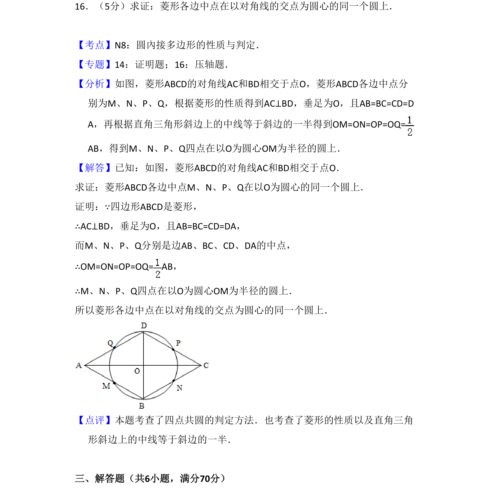
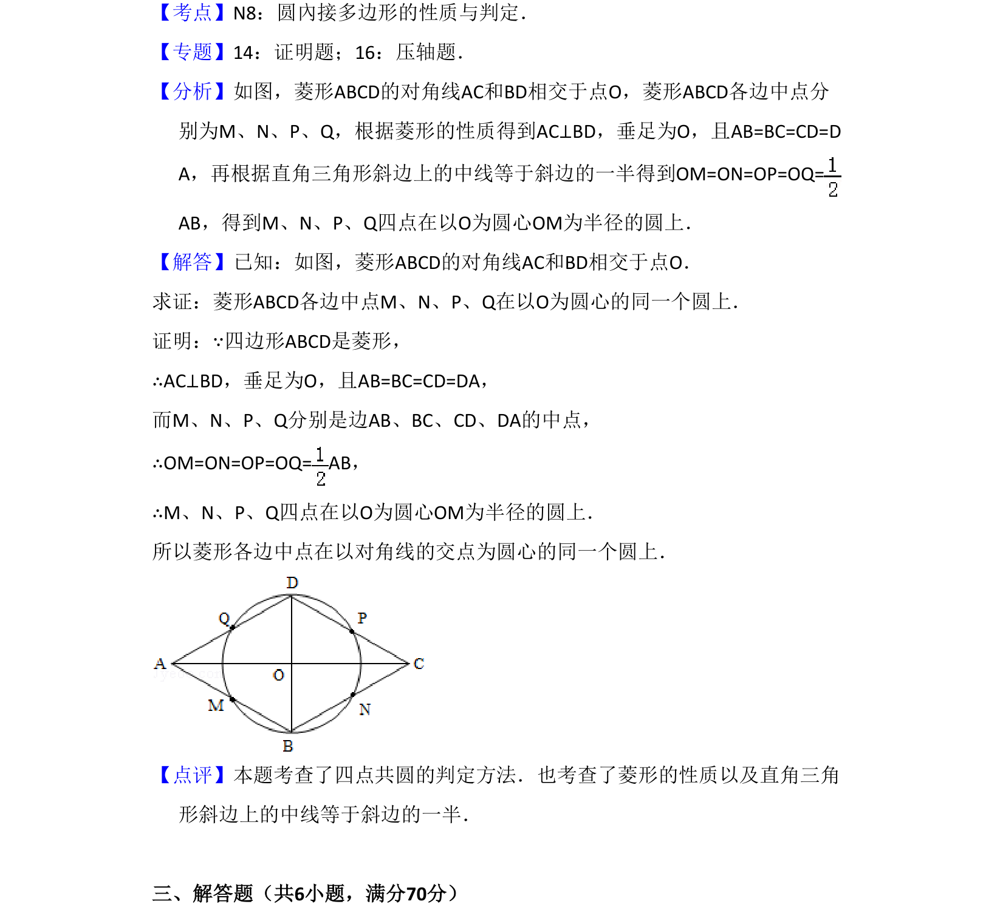

## 题面

## 摘要

菱形各边中点到对角线交点距离相等，证四点共圆

## 关联考点

- [[772-圆內接多边形的性质|圆內接多边形的性质]]
- [[1100-菱形的性质|菱形的性质]]
- [[578-直角三角形斜边中线|直角三角形斜边中线]]

## 答案与解析

> 📄 原 PDF 第 11 页：`素材/真题/吉林/2008-2024·（吉林）数学高考真题/2009年高考数学试卷（理）（全国卷Ⅱ）（解析卷）.pdf`

<!-- 题干文本-start -->
## 题干文本
16．（5分）求证：菱形各边中点在以对角线的交点为圆心的同一个圆上．
<!-- 题干文本-end -->

<!-- 解析文本-start -->
## 解析文本
【考点】N8：圆內接多边形的性质与判定．菁优网版权所有
【专题】14：证明题；16：压轴题．
【分析】如图，菱形ABCD的对角线AC和BD相交于点O，菱形ABCD各边中点分
别为M、N、P、Q，根据菱形的性质得到AC⊥BD，垂足为O，且AB=BC=CD=D
A，再根据直角三角形斜边上的中线等于斜边的一半得到OM=ON=OP=OQ=
AB，得到M、N、P、Q四点在以O为圆心OM为半径的圆上．
【解答】已知：如图，菱形ABCD的对角线AC和BD相交于点O．
求证：菱形ABCD各边中点M、N、P、Q在以O为圆心的同一个圆上．
证明：∵四边形ABCD是菱形，
∴AC⊥BD，垂足为O，且AB=BC=CD=DA，
而M、N、P、Q分别是边AB、BC、CD、DA的中点，
∴OM=ON=OP=OQ= AB，
∴M、N、P、Q四点在以O为圆心OM为半径的圆上．
所以菱形各边中点在以对角线的交点为圆心的同一个圆上．
【点评】本题考查了四点共圆的判定方法．也考查了菱形的性质以及直角三角
形斜边上的中线等于斜边的一半．
　
三、解答题（共6小题，满分70分）
<!-- 解析文本-end -->
