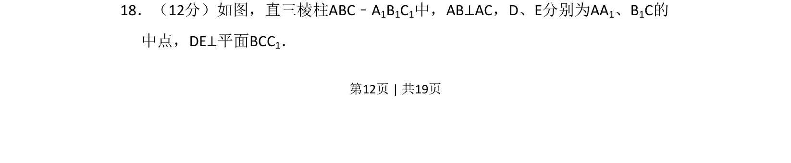
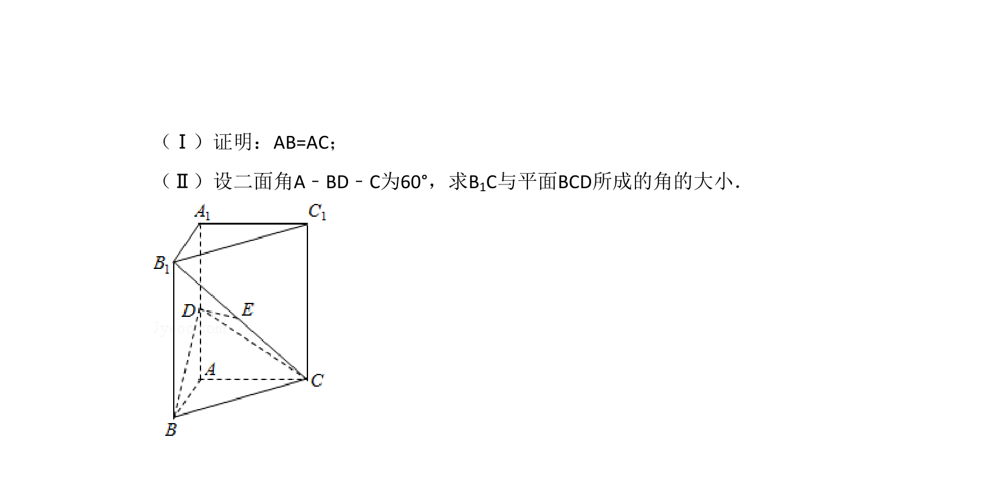
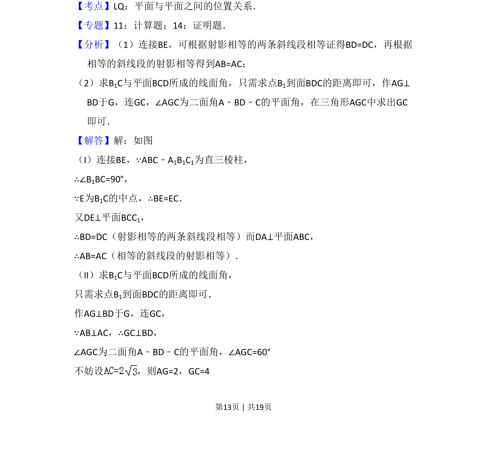
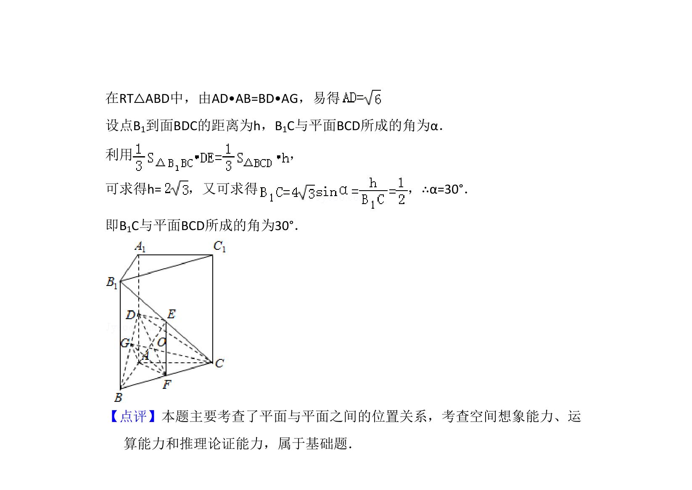

## 题面

## 摘要

在直三棱柱中，已知线线垂直与线面垂直条件，考查空间位置关系的证明或空间角的计算。

## 关联考点

- [[1086-线面垂直的判定与性质|线面垂直的判定与性质]]
- [[401-空间向量基本概念|空间向量]]
- [[934-棱柱的结构特征|棱柱的结构特征]]

## 答案与解析

> 📄 原 PDF 第 12 页：`素材/真题/吉林/2008-2024·（吉林）数学高考真题/2009年高考数学试卷（理）（全国卷Ⅱ）（解析卷）.pdf`
