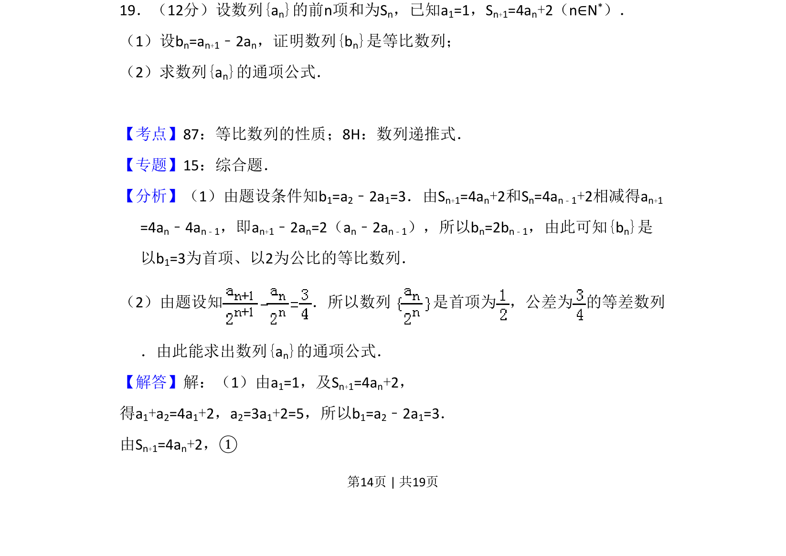
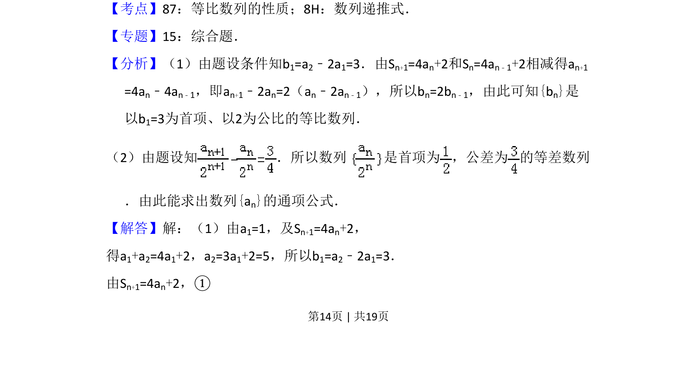
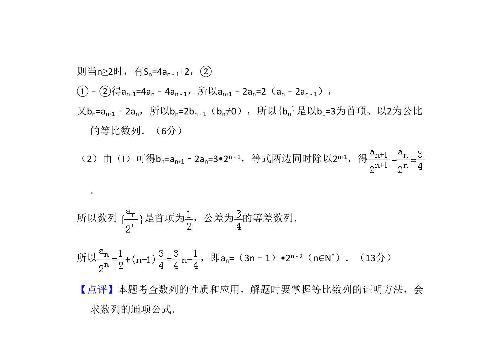

## 题面

## 摘要

本题给出数列前n项和与项的关系，通过递推式证明数列为等比数列并求通项

## 关联考点

- [[1068-等比数列的性质|等比数列的性质]]
- [[894-数列递推式|数列递推式]]

## 答案与解析

> 📄 原 PDF 第 14 页：`素材/真题/吉林/2008-2024·（吉林）数学高考真题/2009年高考数学试卷（理）（全国卷Ⅱ）（解析卷）.pdf`
